# Falcon Airlines Enterprise — PostgreSQL Database Design

## Design Principles

- **3rd Normal Form (3NF)**: Each table represents a single domain concept; transitive dependencies are removed into separate tables.
- **Primary Keys**: Every table uses a surrogate `id` for immutability and to support sharding if needed.
- **Foreign Keys**: All cross-table relationships are explicitly declared to protect referential integrity.
- **Indexes**: B-tree indexes on primary keys, foreign keys, and common search/filter columns; unique indexes on natural identifiers.
- **Constraints**: `NOT NULL`, `UNIQUE`, `CHECK`, and foreign key constraints enforce data quality at the database layer.
- **Audit Columns**: `created_at`, `updated_at`, `created_by`, `updated_by` on every table.
- **Soft Deletes**: `deleted_at` timestamp and `is_deleted` boolean to preserve history and satisfy compliance needs.

---

## Table Definitions

### 1. Users

**Purpose**: Core identity records for customers, agents, and administrators.

| Column | Type | Constraints | Notes |
|--------|------|-------------|-------|
| `id` | `BIGSERIAL` | `PRIMARY KEY` | Surrogate key. |
| `username` | `VARCHAR(50)` | `NOT NULL, UNIQUE` | Display name. |
| `email` | `VARCHAR(255)` | `NOT NULL, UNIQUE` | Login and communication. |
| `password_hash` | `VARCHAR(255)` | `NOT NULL` | Argon2/bcrypt hash. |
| `mobile_number` | `VARCHAR(20)` | `UNIQUE` | Optional for MFA/SMS. |
| `status` | `VARCHAR(20)` | `NOT NULL, CHECK` | e.g., ACTIVE, LOCKED, SUSPENDED. |
| `mfa_enabled` | `BOOLEAN` | `NOT NULL, DEFAULT FALSE` | Toggles MFA. |
| `failed_login_attempts` | `SMALLINT` | `DEFAULT 0` | Brute-force tracking. |
| `locked_until` | `TIMESTAMPTZ` | | Account lockout expiry. |
| `last_login_at` | `TIMESTAMPTZ` | | Last successful login. |
| `created_at` | `TIMESTAMPTZ` | `NOT NULL, DEFAULT now()` | Audit column. |
| `updated_at` | `TIMESTAMPTZ` | `NOT NULL, DEFAULT now()` | Audit column. |
| `created_by` | `BIGINT` | `FOREIGN KEY -> users(id)` | Audit column. |
| `updated_by` | `BIGINT` | `FOREIGN KEY -> users(id)` | Audit column. |
| `deleted_at` | `TIMESTAMPTZ` | | Soft delete. |
| `is_deleted` | `BOOLEAN` | `NOT NULL, DEFAULT FALSE` | Soft delete flag. |

**Relationships & Cardinality**

- `users` **1-to-many** `user_roles`
- `users` **1-to-many** `bookings` (as customer)
- `users` **1-to-many** `notifications` (as recipient)
- `users` **1-to-many** `audit_logs` (as actor)

**Indexes**

- `PK` on `id`
- `UNIQUE` on `email`
- `UNIQUE` on `username`
- `UNIQUE` on `mobile_number`
- Composite on `(status, is_deleted)` for active-user queries.

---

### 2. Roles

**Purpose**: Named job functions to which permissions are assigned.

| Column | Type | Constraints | Notes |
|--------|------|-------------|-------|
| `id` | `BIGSERIAL` | `PRIMARY KEY` | Surrogate key. |
| `name` | `VARCHAR(50)` | `NOT NULL, UNIQUE` | e.g., ADMIN, AGENT, CUSTOMER. |
| `description` | `TEXT` | | Human-readable. |
| `is_system` | `BOOLEAN` | `DEFAULT FALSE` | Built-in roles. |
| `created_at` | `TIMESTAMPTZ` | `NOT NULL, DEFAULT now()` | |
| `updated_at` | `TIMESTAMPTZ` | `NOT NULL, DEFAULT now()` | |
| `created_by` | `BIGINT` | `FOREIGN KEY -> users(id)` | |
| `updated_by` | `BIGINT` | `FOREIGN KEY -> users(id)` | |
| `deleted_at` | `TIMESTAMPTZ` | | |
| `is_deleted` | `BOOLEAN` | `NOT NULL, DEFAULT FALSE` | |

**Relationships & Cardinality**

- `roles` **1-to-many** `user_roles`
- `roles` **1-to-many** `role_permissions`

**Indexes**

- `PK` on `id`
- `UNIQUE` on `name`

---

### 3. Permissions

**Purpose**: Granular authorization primitives aligned to resources and actions.

| Column | Type | Constraints | Notes |
|--------|------|-------------|-------|
| `id` | `BIGSERIAL` | `PRIMARY KEY` | Surrogate key. |
| `code` | `VARCHAR(100)` | `NOT NULL, UNIQUE` | e.g., `BOOKING_CREATE`, `FLIGHT_UPDATE`. |
| `description` | `TEXT` | | |
| `resource` | `VARCHAR(50)` | `NOT NULL` | Domain resource. |
| `action` | `VARCHAR(50)` | `NOT NULL` | e.g., READ, WRITE, DELETE. |
| `created_at` | `TIMESTAMPTZ` | `NOT NULL, DEFAULT now()` | |
| `updated_at` | `TIMESTAMPTZ` | `NOT NULL, DEFAULT now()` | |
| `created_by` | `BIGINT` | `FOREIGN KEY -> users(id)` | |
| `updated_by` | `BIGINT` | `FOREIGN KEY -> users(id)` | |
| `deleted_at` | `TIMESTAMPTZ` | | |
| `is_deleted` | `BOOLEAN` | `NOT NULL, DEFAULT FALSE` | |

**Relationships & Cardinality**

- `permissions` **1-to-many** `role_permissions`

**Indexes**

- `PK` on `id`
- `UNIQUE` on `code`
- Composite on `(resource, action)`.

---

### 4. User_Roles

**Purpose**: Many-to-many linkage between users and roles.

| Column | Type | Constraints | Notes |
|--------|------|-------------|-------|
| `id` | `BIGSERIAL` | `PRIMARY KEY` | Surrogate key. |
| `user_id` | `BIGINT` | `NOT NULL, FOREIGN KEY -> users(id)` | |
| `role_id` | `BIGINT` | `NOT NULL, FOREIGN KEY -> roles(id)` | |
| `valid_from` | `TIMESTAMPTZ` | `NOT NULL, DEFAULT now()` | Role validity start. |
| `valid_until` | `TIMESTAMPTZ` | | Role validity end. |
| `created_at` | `TIMESTAMPTZ` | `NOT NULL, DEFAULT now()` | |
| `updated_at` | `TIMESTAMPTZ` | `NOT NULL, DEFAULT now()` | |
| `created_by` | `BIGINT` | `FOREIGN KEY -> users(id)` | |
| `updated_by` | `BIGINT` | `FOREIGN KEY -> users(id)` | |
| `deleted_at` | `TIMESTAMPTZ` | | |
| `is_deleted` | `BOOLEAN` | `NOT NULL, DEFAULT FALSE` | |

**Relationships & Cardinality**

- `users` **many-to-many** `roles` through `user_roles`

**Indexes**

- `PK` on `id`
- `UNIQUE` on `(user_id, role_id)` where `is_deleted = false`
- `FK` index on `user_id`, `role_id`.

---

### 5. Role_Permissions

**Purpose**: Many-to-many linkage between roles and permissions.

| Column | Type | Constraints | Notes |
|--------|------|-------------|-------|
| `id` | `BIGSERIAL` | `PRIMARY KEY` | Surrogate key. |
| `role_id` | `BIGINT` | `NOT NULL, FOREIGN KEY -> roles(id)` | |
| `permission_id` | `BIGINT` | `NOT NULL, FOREIGN KEY -> permissions(id)` | |
| `created_at` | `TIMESTAMPTZ` | `NOT NULL, DEFAULT now()` | |
| `updated_at` | `TIMESTAMPTZ` | `NOT NULL, DEFAULT now()` | |
| `created_by` | `BIGINT` | `FOREIGN KEY -> users(id)` | |
| `updated_by` | `BIGINT` | `FOREIGN KEY -> users(id)` | |
| `deleted_at` | `TIMESTAMPTZ` | | |
| `is_deleted` | `BOOLEAN` | `NOT NULL, DEFAULT FALSE` | |

**Relationships & Cardinality**

- `roles` **many-to-many** `permissions` through `role_permissions`

**Indexes**

- `PK` on `id`
- `UNIQUE` on `(role_id, permission_id)`
- `FK` index on `role_id`, `permission_id`.

---

### 6. Passengers

**Purpose**: Traveler profiles including identity, contact, and optional account linkage.

| Column | Type | Constraints | Notes |
|--------|------|-------------|-------|
| `id` | `BIGSERIAL` | `PRIMARY KEY` | Surrogate key. |
| `user_id` | `BIGINT` | `FOREIGN KEY -> users(id), NULLABLE` | Links to account if registered. |
| `first_name` | `VARCHAR(100)` | `NOT NULL` | |
| `last_name` | `VARCHAR(100)` | `NOT NULL` | |
| `date_of_birth` | `DATE` | `NOT NULL` | |
| `email` | `VARCHAR(255)` | | Contact email. |
| `phone` | `VARCHAR(20)` | | Contact phone. |
| `passport_number` | `VARCHAR(50)` | | PII; encrypted at application level. |
| `nationality` | `VARCHAR(3)` | | ISO country code. |
| `gender` | `CHAR(1)` | `CHECK` | M/F/X/O. |
| `redress_number` | `VARCHAR(20)` | | Optional security identifier. |
| `created_at` | `TIMESTAMPTZ` | `NOT NULL, DEFAULT now()` | |
| `updated_at` | `TIMESTAMPTZ` | `NOT NULL, DEFAULT now()` | |
| `created_by` | `BIGINT` | `FOREIGN KEY -> users(id)` | |
| `updated_by` | `BIGINT` | `FOREIGN KEY -> users(id)` | |
| `deleted_at` | `TIMESTAMPTZ` | | |
| `is_deleted` | `BOOLEAN` | `NOT NULL, DEFAULT FALSE` | |

**Relationships & Cardinality**

- `users` **1-to-many** `passengers` (a registered user may manage multiple passenger records)
- `passengers` **1-to-many** `booking_passengers`
- `passengers` **1-to-many** `tickets`
- `passengers` **1-to-many** `travel_documents` (normalized extension for passports/visas)

**Indexes**

- `PK` on `id`
- Composite on `(last_name, first_name, date_of_birth)` for duplicate detection.
- Index on `user_id`.

---

### 7. Travel_Documents

**Purpose**: Separate 3NF table for travel documents to avoid repeating variable-length document data.

| Column | Type | Constraints | Notes |
|--------|------|-------------|-------|
| `id` | `BIGSERIAL` | `PRIMARY KEY` | Surrogate key. |
| `passenger_id` | `BIGINT` | `NOT NULL, FOREIGN KEY -> passengers(id)` | |
| `document_type` | `VARCHAR(20)` | `NOT NULL` | PASSPORT, VISA, etc. |
| `document_number` | `VARCHAR(100)` | `NOT NULL` | Encrypted at app layer. |
| `issuing_country` | `VARCHAR(3)` | `NOT NULL` | ISO code. |
| `issue_date` | `DATE` | | |
| `expiry_date` | `DATE` | `NOT NULL` | |
| `created_at` | `TIMESTAMPTZ` | `NOT NULL, DEFAULT now()` | |
| `updated_at` | `TIMESTAMPTZ` | `NOT NULL, DEFAULT now()` | |
| `created_by` | `BIGINT` | `FOREIGN KEY -> users(id)` | |
| `updated_by` | `BIGINT` | `FOREIGN KEY -> users(id)` | |
| `deleted_at` | `TIMESTAMPTZ` | | |
| `is_deleted` | `BOOLEAN` | `NOT NULL, DEFAULT FALSE` | |

**Relationships & Cardinality**

- `passengers` **1-to-many** `travel_documents`

**Indexes**

- `PK` on `id`
- `FK` index on `passenger_id`.

---

### 8. Airports

**Purpose**: Master reference for airports, terminals, and operational rules.

| Column | Type | Constraints | Notes |
|--------|------|-------------|-------|
| `id` | `BIGSERIAL` | `PRIMARY KEY` | Surrogate key. |
| `iata_code` | `CHAR(3)` | `NOT NULL, UNIQUE` | e.g., DEL, DXB. |
| `icao_code` | `CHAR(4)` | `UNIQUE` | Optional. |
| `name` | `VARCHAR(200)` | `NOT NULL` | |
| `city` | `VARCHAR(100)` | `NOT NULL` | |
| `country` | `CHAR(2)` | `NOT NULL` | ISO 3166-1 alpha-2. |
| `time_zone` | `VARCHAR(50)` | `NOT NULL` | IANA time zone. |
| `latitude` | `DECIMAL(10,8)` | | |
| `longitude` | `DECIMAL(11,8)` | | |
| `is_active` | `BOOLEAN` | `NOT NULL, DEFAULT TRUE` | |
| `created_at` | `TIMESTAMPTZ` | `NOT NULL, DEFAULT now()` | |
| `updated_at` | `TIMESTAMPTZ` | `NOT NULL, DEFAULT now()` | |
| `created_by` | `BIGINT` | `FOREIGN KEY -> users(id)` | |
| `updated_by` | `BIGINT` | `FOREIGN KEY -> users(id)` | |
| `deleted_at` | `TIMESTAMPTZ` | | |
| `is_deleted` | `BOOLEAN` | `NOT NULL, DEFAULT FALSE` | |

**Relationships & Cardinality**

- `airports` **1-to-many** `flights` as `origin`
- `airports` **1-to-many** `flights` as `destination`

**Indexes**

- `PK` on `id`
- `UNIQUE` on `iata_code`
- `UNIQUE` on `icao_code` (where not null)
- Composite on `(country, is_active)`.

---

### 9. Aircraft

**Purpose**: Fleet master data including registration, type, and capacity.

| Column | Type | Constraints | Notes |
|--------|------|-------------|-------|
| `id` | `BIGSERIAL` | `PRIMARY KEY` | Surrogate key. |
| `registration_number` | `VARCHAR(20)` | `NOT NULL, UNIQUE` | e.g., VT-IXB. |
| `type` | `VARCHAR(50)` | `NOT NULL` | A320, B777. |
| `model` | `VARCHAR(100)` | `NOT NULL` | e.g., A320-200. |
| `manufacturer` | `VARCHAR(100)` | `NOT NULL` | e.g., Airbus. |
| `total_capacity` | `SMALLINT` | `NOT NULL, CHECK > 0` | |
| `configuration` | `JSONB` | | Seat/cabin layout. |
| `created_at` | `TIMESTAMPTZ` | `NOT NULL, DEFAULT now()` | |
| `updated_at` | `TIMESTAMPTZ` | `NOT NULL, DEFAULT now()` | |
| `created_by` | `BIGINT` | `FOREIGN KEY -> users(id)` | |
| `updated_by` | `BIGINT` | `FOREIGN KEY -> users(id)` | |
| `deleted_at` | `TIMESTAMPTZ` | | |
| `is_deleted` | `BOOLEAN` | `NOT NULL, DEFAULT FALSE` | |

**Relationships & Cardinality**

- `aircraft` **1-to-many** `flights`

**Indexes**

- `PK` on `id`
- `UNIQUE` on `registration_number`
- Index on `type`.

---

### 10. Flights

**Purpose**: Scheduled commercial services between origin and destination.

| Column | Type | Constraints | Notes |
|--------|------|-------------|-------|
| `id` | `BIGSERIAL` | `PRIMARY KEY` | Surrogate key. |
| `flight_number` | `VARCHAR(10)` | `NOT NULL` | e.g., 6E-123. |
| `origin_airport_id` | `BIGINT` | `NOT NULL, FOREIGN KEY -> airports(id)` | |
| `destination_airport_id` | `BIGINT` | `NOT NULL, FOREIGN KEY -> airports(id)` | |
| `aircraft_id` | `BIGINT` | `NOT NULL, FOREIGN KEY -> aircraft(id)` | |
| `scheduled_departure` | `TIMESTAMPTZ` | `NOT NULL` | |
| `scheduled_arrival` | `TIMESTAMPTZ` | `NOT NULL` | |
| `status` | `VARCHAR(20)` | `NOT NULL` | SCHEDULED, DELAYED, CANCELLED, etc. |
| `terminal` | `VARCHAR(10)` | | |
| `gate` | `VARCHAR(10)` | | |
| `is_active` | `BOOLEAN` | `NOT NULL, DEFAULT TRUE` | |
| `created_at` | `TIMESTAMPTZ` | `NOT NULL, DEFAULT now()` | |
| `updated_at` | `TIMESTAMPTZ` | `NOT NULL, DEFAULT now()` | |
| `created_by` | `BIGINT` | `FOREIGN KEY -> users(id)` | |
| `updated_by` | `BIGINT` | `FOREIGN KEY -> users(id)` | |
| `deleted_at` | `TIMESTAMPTZ` | | |
| `is_deleted` | `BOOLEAN` | `NOT NULL, DEFAULT FALSE` | |

**Relationships & Cardinality**

- `flights` **many-to-one** `airports` (origin and destination)
- `flights` **many-to-one** `aircraft`
- `flights` **1-to-many** `tickets`
- `flights` **1-to-many** `delay_predictions`

**Indexes**

- `PK` on `id`
- Composite on `(origin_airport_id, destination_airport_id, scheduled_departure)` for search.
- Index on `aircraft_id`.
- Index on `status`.
- Partial index on `is_active = true AND is_deleted = false`.

---

### 11. Bookings

**Purpose**: Parent reservation record and commercial summary for a trip.

| Column | Type | Constraints | Notes |
|--------|------|-------------|-------|
| `id` | `BIGSERIAL` | `PRIMARY KEY` | Surrogate key. |
| `booking_reference` | `VARCHAR(10)` | `NOT NULL, UNIQUE` | PNR e.g., A1B2C3. |
| `customer_id` | `BIGINT` | `NOT NULL, FOREIGN KEY -> users(id)` | Booking owner. |
| `status` | `VARCHAR(20)` | `NOT NULL` | PENDING, CONFIRMED, CANCELLED, etc. |
| `total_amount` | `DECIMAL(15,2)` | `NOT NULL, CHECK >= 0` | |
| `currency` | `CHAR(3)` | `NOT NULL` | ISO 4217. |
| `booking_date` | `TIMESTAMPTZ` | `NOT NULL, DEFAULT now()` | |
| `time_limit` | `TIMESTAMPTZ` | | Ticketing deadline. |
| `payment_status` | `VARCHAR(20)` | `NOT NULL` | PENDING, PAID, REFUNDED. |
| `created_at` | `TIMESTAMPTZ` | `NOT NULL, DEFAULT now()` | |
| `updated_at` | `TIMESTAMPTZ` | `NOT NULL, DEFAULT now()` | |
| `created_by` | `BIGINT` | `FOREIGN KEY -> users(id)` | |
| `updated_by` | `BIGINT` | `FOREIGN KEY -> users(id)` | |
| `deleted_at` | `TIMESTAMPTZ` | | |
| `is_deleted` | `BOOLEAN` | `NOT NULL, DEFAULT FALSE` | |

**Relationships & Cardinality**

- `users` **1-to-many** `bookings`
- `bookings` **1-to-many** `booking_passengers`
- `bookings` **1-to-many** `tickets`
- `bookings` **1-to-many** `payments`
- `bookings` **1-to-many** `notifications` (via reference)

**Indexes**

- `PK` on `id`
- `UNIQUE` on `booking_reference`
- `FK` index on `customer_id`.
- Composite on `(status, payment_status)`.
- Index on `booking_date`.

---

### 12. Booking_Passengers

**Purpose**: Many-to-many bridge between bookings and passengers with segment-specific attributes.

| Column | Type | Constraints | Notes |
|--------|------|-------------|-------|
| `id` | `BIGSERIAL` | `PRIMARY KEY` | Surrogate key. |
| `booking_id` | `BIGINT` | `NOT NULL, FOREIGN KEY -> bookings(id)` | |
| `passenger_id` | `BIGINT` | `NOT NULL, FOREIGN KEY -> passengers(id)` | |
| `fare_class` | `CHAR(1)` | `NOT NULL` | e.g., Y, M, L. |
| `cabin` | `VARCHAR(20)` | `NOT NULL` | ECONOMY, BUSINESS. |
| `ssr_codes` | `VARCHAR[]` | | Array of SSR codes. |
| `created_at` | `TIMESTAMPTZ` | `NOT NULL, DEFAULT now()` | |
| `updated_at` | `TIMESTAMPTZ` | `NOT NULL, DEFAULT now()` | |
| `created_by` | `BIGINT` | `FOREIGN KEY -> users(id)` | |
| `updated_by` | `BIGINT` | `FOREIGN KEY -> users(id)` | |
| `deleted_at` | `TIMESTAMPTZ` | | |
| `is_deleted` | `BOOLEAN` | `NOT NULL, DEFAULT FALSE` | |

**Relationships & Cardinality**

- `bookings` **many-to-many** `passengers` through `booking_passengers`

**Indexes**

- `PK` on `id`
- `UNIQUE` on `(booking_id, passenger_id)`
- `FK` indexes on `booking_id` and `passenger_id`.

---

### 13. Tickets

**Purpose**: Issued travel documents linked to a booking, passenger, and flight.

| Column | Type | Constraints | Notes |
|--------|------|-------------|-------|
| `id` | `BIGSERIAL` | `PRIMARY KEY` | Surrogate key. |
| `ticket_number` | `VARCHAR(20)` | `NOT NULL, UNIQUE` | e.g., 234-1234567890. |
| `booking_id` | `BIGINT` | `NOT NULL, FOREIGN KEY -> bookings(id)` | |
| `passenger_id` | `BIGINT` | `NOT NULL, FOREIGN KEY -> passengers(id)` | |
| `flight_id` | `BIGINT` | `NOT NULL, FOREIGN KEY -> flights(id)` | |
| `fare_basis` | `VARCHAR(10)` | `NOT NULL` | |
| `fare` | `DECIMAL(15,2)` | `NOT NULL` | |
| `taxes` | `DECIMAL(15,2)` | `NOT NULL` | |
| `status` | `VARCHAR(20)` | `NOT NULL` | ISSUED, VOID, REFUNDED, USED. |
| `issued_at` | `TIMESTAMPTZ` | `NOT NULL` | |
| `created_at` | `TIMESTAMPTZ` | `NOT NULL, DEFAULT now()` | |
| `updated_at` | `TIMESTAMPTZ` | `NOT NULL, DEFAULT now()` | |
| `created_by` | `BIGINT` | `FOREIGN KEY -> users(id)` | |
| `updated_by` | `BIGINT` | `FOREIGN KEY -> users(id)` | |
| `deleted_at` | `TIMESTAMPTZ` | | |
| `is_deleted` | `BOOLEAN` | `NOT NULL, DEFAULT FALSE` | |

**Relationships & Cardinality**

- `tickets` **many-to-one** `bookings`
- `tickets` **many-to-one** `passengers`
- `tickets` **many-to-one** `flights`

**Indexes**

- `PK` on `id`
- `UNIQUE` on `ticket_number`
- `FK` indexes on `booking_id`, `passenger_id`, `flight_id`.
- Partial index on `status = 'ISSUED'`.

---

### 14. Payments

**Purpose**: Records of all monetary transactions against bookings.

| Column | Type | Constraints | Notes |
|--------|------|-------------|-------|
| `id` | `BIGSERIAL` | `PRIMARY KEY` | Surrogate key. |
| `booking_id` | `BIGINT` | `NOT NULL, FOREIGN KEY -> bookings(id)` | |
| `transaction_id` | `VARCHAR(100)` | `NOT NULL, UNIQUE` | Internal reference. |
| `amount` | `DECIMAL(15,2)` | `NOT NULL` | |
| `currency` | `CHAR(3)` | `NOT NULL` | |
| `payment_method` | `VARCHAR(50)` | `NOT NULL` | CARD, WALLET, UPI, POINTS. |
| `status` | `VARCHAR(20)` | `NOT NULL` | AUTHORIZED, CAPTURED, REFUNDED, FAILED. |
| `gateway_reference` | `VARCHAR(255)` | | PSP token. |
| `paid_at` | `TIMESTAMPTZ` | | |
| `created_at` | `TIMESTAMPTZ` | `NOT NULL, DEFAULT now()` | |
| `updated_at` | `TIMESTAMPTZ` | `NOT NULL, DEFAULT now()` | |
| `created_by` | `BIGINT` | `FOREIGN KEY -> users(id)` | |
| `updated_by` | `BIGINT` | `FOREIGN KEY -> users(id)` | |
| `deleted_at` | `TIMESTAMPTZ` | | |
| `is_deleted` | `BOOLEAN` | `NOT NULL, DEFAULT FALSE` | |

**Relationships & Cardinality**

- `payments` **many-to-one** `bookings`

**Indexes**

- `PK` on `id`
- `UNIQUE` on `transaction_id`
- `FK` index on `booking_id`.
- Composite on `(status, created_at)` for reconciliation.

---

### 15. Notifications

**Purpose**: Stores all outbound communication attempts to users/passengers.

| Column | Type | Constraints | Notes |
|--------|------|-------------|-------|
| `id` | `BIGSERIAL` | `PRIMARY KEY` | Surrogate key. |
| `recipient_id` | `BIGINT` | `NOT NULL, FOREIGN KEY -> users(id)` | Account owner if known. |
| `booking_id` | `BIGINT` | `FOREIGN KEY -> bookings(id)` | Optional context. |
| `channel` | `VARCHAR(20)` | `NOT NULL` | EMAIL, SMS, PUSH. |
| `template_code` | `VARCHAR(50)` | | |
| `subject` | `VARCHAR(255)` | | |
| `content` | `TEXT` | | Rendered message. |
| `status` | `VARCHAR(20)` | `NOT NULL` | QUEUED, SENT, FAILED, DELIVERED. |
| `sent_at` | `TIMESTAMPTZ` | | |
| `created_at` | `TIMESTAMPTZ` | `NOT NULL, DEFAULT now()` | |
| `updated_at` | `TIMESTAMPTZ` | `NOT NULL, DEFAULT now()` | |
| `created_by` | `BIGINT` | `FOREIGN KEY -> users(id)` | |
| `updated_by` | `BIGINT` | `FOREIGN KEY -> users(id)` | |
| `deleted_at` | `TIMESTAMPTZ` | | |
| `is_deleted` | `BOOLEAN` | `NOT NULL, DEFAULT FALSE` | |

**Relationships & Cardinality**

- `notifications` **many-to-one** `users`
- `notifications` **many-to-one** `bookings`

**Indexes**

- `PK` on `id`
- `FK` index on `recipient_id`.
- `FK` index on `booking_id`.
- Composite on `(status, created_at)`.

---

### 16. Audit_Logs

**Purpose**: Immutable record of who changed what and when.

| Column | Type | Constraints | Notes |
|--------|------|-------------|-------|
| `id` | `BIGSERIAL` | `PRIMARY KEY` | Surrogate key. |
| `actor_id` | `BIGINT` | `FOREIGN KEY -> users(id)` | Who performed the action. |
| `action` | `VARCHAR(50)` | `NOT NULL` | CREATE, UPDATE, DELETE, LOGIN. |
| `entity_type` | `VARCHAR(50)` | `NOT NULL` | Table/domain name. |
| `entity_id` | `BIGINT` | `NOT NULL` | Record primary key. |
| `old_values` | `JSONB` | | Previous state. |
| `new_values` | `JSONB` | | New state. |
| `ip_address` | `VARCHAR(45)` | | IPv4/IPv6. |
| `user_agent` | `TEXT` | | Optional. |
| `occurred_at` | `TIMESTAMPTZ` | `NOT NULL, DEFAULT now()` | |
| `created_at` | `TIMESTAMPTZ` | `NOT NULL, DEFAULT now()` | |

**Relationships & Cardinality**

- `audit_logs` **many-to-one** `users`

**Indexes**

- `PK` on `id`
- Composite on `(entity_type, entity_id, occurred_at)`.
- Index on `actor_id`.
- BRIN index on `occurred_at` for range scans.

**Note**: No soft delete or update columns; audit rows are append-only.

---

### 17. Delay_Predictions

**Purpose**: ML-generated delay forecasts for flights.

| Column | Type | Constraints | Notes |
|--------|------|-------------|-------|
| `id` | `BIGSERIAL` | `PRIMARY KEY` | Surrogate key. |
| `flight_id` | `BIGINT` | `NOT NULL, FOREIGN KEY -> flights(id)` | |
| `prediction_time` | `TIMESTAMPTZ` | `NOT NULL` | When prediction was made. |
| `predicted_delay_minutes` | `INTEGER` | `NOT NULL, CHECK >= 0` | |
| `probability` | `DECIMAL(5,4)` | `NOT NULL, CHECK BETWEEN 0 AND 1` | 0.0 to 1.0. |
| `risk_level` | `VARCHAR(20)` | `NOT NULL` | LOW, MEDIUM, HIGH. |
| `factors` | `JSONB` | | Input features and weights. |
| `model_version` | `VARCHAR(50)` | `NOT NULL` | Tracking. |
| `created_at` | `TIMESTAMPTZ` | `NOT NULL, DEFAULT now()` | |
| `updated_at` | `TIMESTAMPTZ` | `NOT NULL, DEFAULT now()` | |
| `created_by` | `BIGINT` | `FOREIGN KEY -> users(id)` | System user. |
| `updated_by` | `BIGINT` | `FOREIGN KEY -> users(id)` | System user. |
| `deleted_at` | `TIMESTAMPTZ` | | |
| `is_deleted` | `BOOLEAN` | `NOT NULL, DEFAULT FALSE` | |

**Relationships & Cardinality**

- `delay_predictions` **many-to-one** `flights`

**Indexes**

- `PK` on `id`
- `FK` index on `flight_id`.
- Composite on `(flight_id, prediction_time)`.
- Index on `risk_level`.

---

## ER Diagram

```mermaid
erDiagram
    USERS ||--o{ USER_ROLES : "assigned"
    ROLES ||--o{ USER_ROLES : "granted_to"
    ROLES ||--o{ ROLE_PERMISSIONS : "includes"
    PERMISSIONS ||--o{ ROLE_PERMISSIONS : "included_in"

    USERS ||--o{ PASSENGERS : "manages"
    PASSENGERS ||--o{ TRAVEL_DOCUMENTS : "has"
    PASSENGERS ||--o{ BOOKING_PASSENGERS : "travels_as"
    PASSENGERS ||--o{ TICKETS : "holds"

    USERS ||--o{ BOOKINGS : "makes"
    BOOKINGS ||--|{ BOOKING_PASSENGERS : "contains"
    BOOKINGS ||--o{ TICKETS : "generates"
    BOOKINGS ||--o{ PAYMENTS : "pays"
    BOOKINGS ||--o{ NOTIFICATIONS : "receives"

    AIRPORTS ||--o{ FLIGHTS : "origin"
    AIRPORTS ||--o{ FLIGHTS : "destination"
    AIRCRAFT ||--o{ FLIGHTS : "assigned_to"
    FLIGHTS ||--o{ TICKETS : "serves"
    FLIGHTS ||--o{ DELAY_PREDICTIONS : "forecasted_by"

    USERS ||--o{ AUDIT_LOGS : "performs"
    USERS ||--o{ NOTIFICATIONS : "notified"

    USERS {
        BIGINT id PK
        VARCHAR username UK
        VARCHAR email UK
        VARCHAR password_hash
        BOOLEAN mfa_enabled
        TIMESTAMPTZ created_at
        TIMESTAMPTZ updated_at
        TIMESTAMPTZ deleted_at
        BOOLEAN is_deleted
    }

    ROLES {
        BIGINT id PK
        VARCHAR name UK
        TEXT description
        BOOLEAN is_system
        TIMESTAMPTZ deleted_at
        BOOLEAN is_deleted
    }

    PERMISSIONS {
        BIGINT id PK
        VARCHAR code UK
        VARCHAR resource
        VARCHAR action
        TIMESTAMPTZ deleted_at
        BOOLEAN is_deleted
    }

    USER_ROLES {
        BIGINT id PK
        BIGINT user_id FK
        BIGINT role_id FK
        TIMESTAMPTZ valid_from
        TIMESTAMPTZ valid_until
    }

    ROLE_PERMISSIONS {
        BIGINT id PK
        BIGINT role_id FK
        BIGINT permission_id FK
    }

    PASSENGERS {
        BIGINT id PK
        BIGINT user_id FK
        VARCHAR first_name
        VARCHAR last_name
        DATE date_of_birth
        VARCHAR email
        VARCHAR phone
        VARCHAR passport_number
        VARCHAR nationality
        CHAR gender
        TIMESTAMPTZ deleted_at
        BOOLEAN is_deleted
    }

    TRAVEL_DOCUMENTS {
        BIGINT id PK
        BIGINT passenger_id FK
        VARCHAR document_type
        VARCHAR document_number
        VARCHAR issuing_country
        DATE expiry_date
    }

    AIRPORTS {
        BIGINT id PK
        CHAR iata_code UK
        CHAR icao_code UK
        VARCHAR name
        VARCHAR city
        CHAR country
        VARCHAR time_zone
        BOOLEAN is_active
        TIMESTAMPTZ deleted_at
        BOOLEAN is_deleted
    }

    AIRCRAFT {
        BIGINT id PK
        VARCHAR registration_number UK
        VARCHAR type
        VARCHAR model
        VARCHAR manufacturer
        SMALLINT total_capacity
        JSONB configuration
        TIMESTAMPTZ deleted_at
        BOOLEAN is_deleted
    }

    FLIGHTS {
        BIGINT id PK
        VARCHAR flight_number
        BIGINT origin_airport_id FK
        BIGINT destination_airport_id FK
        BIGINT aircraft_id FK
        TIMESTAMPTZ scheduled_departure
        TIMESTAMPTZ scheduled_arrival
        VARCHAR status
        VARCHAR terminal
        VARCHAR gate
        BOOLEAN is_active
        TIMESTAMPTZ deleted_at
        BOOLEAN is_deleted
    }

    BOOKINGS {
        BIGINT id PK
        VARCHAR booking_reference UK
        BIGINT customer_id FK
        VARCHAR status
        DECIMAL total_amount
        CHAR currency
        TIMESTAMPTZ time_limit
        VARCHAR payment_status
        TIMESTAMPTZ deleted_at
        BOOLEAN is_deleted
    }

    BOOKING_PASSENGERS {
        BIGINT id PK
        BIGINT booking_id FK
        BIGINT passenger_id FK
        CHAR fare_class
        VARCHAR cabin
        VARCHAR[] ssr_codes
    }

    TICKETS {
        BIGINT id PK
        VARCHAR ticket_number UK
        BIGINT booking_id FK
        BIGINT passenger_id FK
        BIGINT flight_id FK
        VARCHAR fare_basis
        DECIMAL fare
        DECIMAL taxes
        VARCHAR status
        TIMESTAMPTZ issued_at
    }

    PAYMENTS {
        BIGINT id PK
        BIGINT booking_id FK
        VARCHAR transaction_id UK
        DECIMAL amount
        CHAR currency
        VARCHAR payment_method
        VARCHAR status
        VARCHAR gateway_reference
        TIMESTAMPTZ paid_at
    }

    NOTIFICATIONS {
        BIGINT id PK
        BIGINT recipient_id FK
        BIGINT booking_id FK
        VARCHAR channel
        VARCHAR template_code
        VARCHAR subject
        TEXT content
        VARCHAR status
        TIMESTAMPTZ sent_at
    }

    AUDIT_LOGS {
        BIGINT id PK
        BIGINT actor_id FK
        VARCHAR action
        VARCHAR entity_type
        BIGINT entity_id
        JSONB old_values
        JSONB new_values
        VARCHAR ip_address
        TIMESTAMPTZ occurred_at
    }

    DELAY_PREDICTIONS {
        BIGINT id PK
        BIGINT flight_id FK
        TIMESTAMPTZ prediction_time
        INTEGER predicted_delay_minutes
        DECIMAL probability
        VARCHAR risk_level
        JSONB factors
        VARCHAR model_version
    }
```

