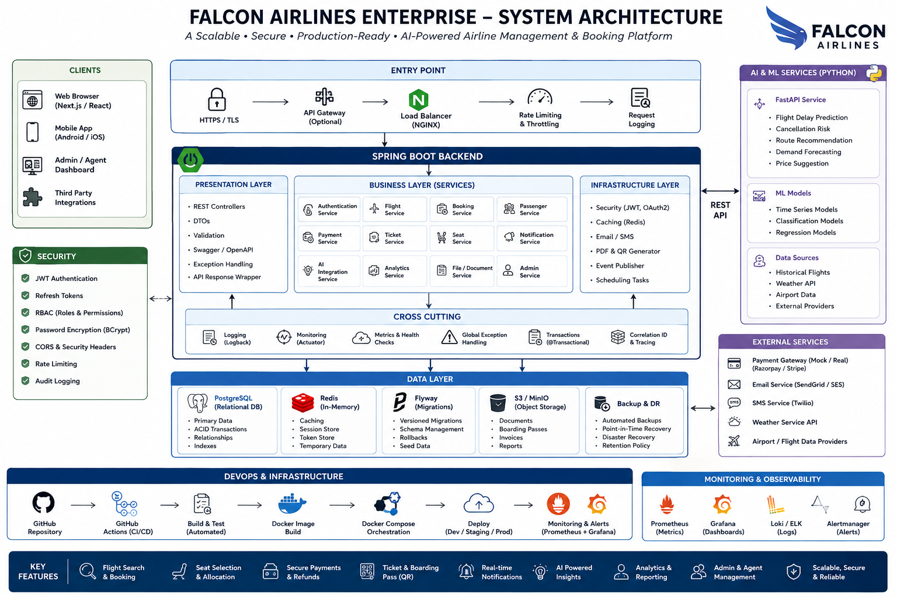

# Falcon Airlines Enterprise

Production-grade Airline Reservation Platform — engineering foundation for Phases 1 and 2.

## Architecture



## Status

Phase 1 is complete: a runnable Spring Boot 3.x backend with Java 21, PostgreSQL, Flyway, Docker, Testcontainers, Swagger, and GitHub Actions.
The database layer is in place for Phase 2.
Business modules (auth, booking, payment, ticketing) are planned for Phase 3.

## Repository Structure

```
Falcon-Airlines/
├── .github/workflows/
│   ├── build.yml
│   ├── test.yml
│   ├── ci.yml
│   └── codeql.yml
├── docs/
│   ├── architecture/
│   │   └── arch.png
│   ├── design/
│   ├── api/
│   ├── learning/
│   ├── interview/
│   ├── deployment/
│   └── adr/
├── falcon-airlines-enterprise/
│   ├── backend/
│   ├── frontend/
│   ├── python-ai/
│   ├── docker/
│   ├── database/
│   ├── testing/
│   └── scripts/
├── legacy/
│   ├── swing-app/
│   ├── frontend/
│   ├── python-ai/
│   ├── database/
│   └── assets/
├── README.md
├── LICENSE
├── CHANGELOG.md
├── CONTRIBUTING.md
├── ROADMAP.md
└── .gitignore
```

## Quick Start

```bash
cd falcon-airlines-enterprise/docker
cp .env.example .env
docker-compose up -d postgres

cd ../backend
mvn clean install
mvn spring-boot:run -Dspring.profiles.active=dev
```

Verify the foundation:

- Health: http://localhost:8080/actuator/health
- Swagger UI: http://localhost:8080/swagger-ui.html

## Documentation

- `docs/deployment/Setup.md` — detailed setup and test commands
- `docs/design/Project-Structure.md` — repository layout
- `docs/design/Architecture.md` — system architecture
- `docs/design/Database-Design.md` — database design
- `docs/design/REST-API.md` — API contract
- `docs/learning/` — focused technology notes

## License

See [LICENSE](LICENSE).
