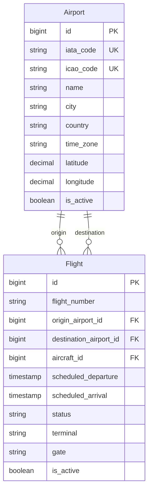

# Airport Domain

## Purpose
The Airport domain manages the inventory of airports in the Falcon Airlines system. It provides CRUD operations, search capabilities, and ensures data integrity through validation and uniqueness constraints. Airports serve as the foundational entities for flight scheduling, as every flight must have an origin and destination airport.

## Entity
The `Airport` entity is defined in `com.falcon.airlines.entity.Airport`. It extends `AuditEntity`, which provides audit fields (created_at, updated_at, created_by, updated_by, deleted_at, is_deleted) inherited from `BaseEntity`.

```java
@Entity
@Table(name = "airports")
@SQLRestriction("is_deleted = false")
public class Airport extends AuditEntity
```

The `@SQLRestriction("is_deleted = false")` annotation ensures that soft-deleted records are automatically filtered out from all JPA queries.

## Database Structure
The airports table is defined in the Flyway migration `V2__create_schema.sql`:

```sql
CREATE TABLE IF NOT EXISTS airports (
    id BIGSERIAL PRIMARY KEY,
    iata_code CHAR(3) NOT NULL UNIQUE,
    icao_code CHAR(4) UNIQUE,
    name VARCHAR(200) NOT NULL,
    city VARCHAR(100) NOT NULL,
    country CHAR(2) NOT NULL,
    time_zone VARCHAR(50) NOT NULL,
    latitude DECIMAL(10,8),
    longitude DECIMAL(11,8),
    is_active BOOLEAN NOT NULL DEFAULT TRUE,
    created_at TIMESTAMPTZ NOT NULL DEFAULT now(),
    updated_at TIMESTAMPTZ NOT NULL DEFAULT now(),
    created_by BIGINT REFERENCES users(id),
    updated_by BIGINT REFERENCES users(id),
    deleted_at TIMESTAMPTZ,
    is_deleted BOOLEAN NOT NULL DEFAULT FALSE
);
```

Indexes supporting airport queries:
- `idx_airports_country_active` on (country, is_active)
- Unique constraint on `iata_code`
- Unique constraint on `icao_code`

## Fields

| Field | Type | Database Column | Nullable | Unique | Description |
|-------|------|-----------------|----------|--------|-------------|
| id | Long | id | No | Yes | Primary key (auto-generated) |
| iataCode | String | iata_code | No | Yes | 3-character IATA airport code |
| icaoCode | String | icao_code | Yes | Yes | 4-character ICAO airport code |
| name | String | name | No | No | Full airport name |
| city | String | city | No | No | City where airport is located |
| country | String | country | No | No | 2-character ISO country code |
| timeZone | String | time_zone | No | No | IANA time zone identifier |
| latitude | BigDecimal | latitude | Yes | No | Geographic latitude (decimal degrees) |
| longitude | BigDecimal | longitude | Yes | No | Geographic longitude (decimal degrees) |
| isActive | Boolean | is_active | No | No | Whether airport is active for operations |

## Validation Rules
Validation is enforced at the DTO level in `AirportRequest`:

- **iataCode**: `@NotBlank`, `@Size(min = 3, max = 3)` - Required, exactly 3 characters
- **icaoCode**: `@Size(min = 4, max = 4)` - Optional, but if provided must be exactly 4 characters
- **name**: `@NotBlank`, `@Size(max = 200)` - Required, maximum 200 characters
- **city**: `@NotBlank`, `@Size(max = 100)` - Required, maximum 100 characters
- **country**: `@NotBlank`, `@Size(min = 2, max = 2)` - Required, exactly 2 characters
- **timeZone**: `@NotBlank`, `@Size(max = 50)` - Required, maximum 50 characters
- **latitude**: Optional, no validation constraints
- **longitude**: Optional, no validation constraints
- **isActive**: Optional, defaults to true if not provided

## Uniqueness
Uniqueness is enforced at both database and application levels:

1. **Database level**: UNIQUE constraints on `iata_code` and `icao_code`
2. **Application level**: `AirportService.validateUniqueness()` checks for duplicates before create/update operations

The service uses repository methods:
- `findByIataCode(String iataCode)` - for create operations
- `findByIataCodeAndIdNot(String iataCode, Long id)` - for update operations (excludes current record)
- `findByIcaoCode(String icaoCode)` - for create operations
- `findByIcaoCodeAndIdNot(String icaoCode, Long id)` - for update operations

If a duplicate is found, a `BaseException` is thrown with error code `DUPLICATE_IATA_CODE` or `DUPLICATE_ICAO_CODE` and HTTP status `409 CONFLICT`.

## CRUD Operations

### Create
- **Endpoint**: `POST /api/airports`
- **Controller**: `AirportController.createAirport()`
- **Service**: `AirportService.createAirport()`
- **Authorization**: `@PreAuthorize("hasRole('ADMIN')")`
- **Validation**: `@Valid` on `AirportRequest`
- **Response**: `201 CREATED` with `AirportResponse`

### Read (by ID)
- **Endpoint**: `GET /api/airports/{id}`
- **Controller**: `AirportController.getAirportById()`
- **Service**: `AirportService.getAirportById()`
- **Authorization**: `@PreAuthorize("hasAnyAuthority('FLIGHT_READ')")`
- **Response**: `200 OK` with `AirportResponse`
- **Error**: `404 NOT_FOUND` if airport does not exist

### Update
- **Endpoint**: `PUT /api/airports/{id}`
- **Controller**: `AirportController.updateAirport()`
- **Service**: `AirportService.updateAirport()`
- **Authorization**: `@PreAuthorize("hasRole('ADMIN')")`
- **Validation**: `@Valid` on `AirportRequest`
- **Response**: `200 OK` with `AirportResponse`
- **Error**: `404 NOT_FOUND` if airport does not exist, `409 CONFLICT` for duplicate codes

### Delete
- **Endpoint**: `DELETE /api/airports/{id}`
- **Controller**: `AirportController.deleteAirport()`
- **Service**: `AirportService.deleteAirport()`
- **Authorization**: `@PreAuthorize("hasRole('ADMIN')")`
- **Implementation**: Soft delete - sets `isActive = false`, `isDeleted = true`, `deletedAt = now()`
- **Referential Integrity Check**: Prevents deletion if airport is referenced by active flights
  - Checks: `flightRepository.existsByOriginAirportIdAndIsActiveTrue(id)` or `flightRepository.existsByDestinationAirportIdAndIsActiveTrue(id)`
  - Error: `409 CONFLICT` with code `AIRPORT_IN_USE` if referenced
- **Response**: `200 OK`

## Search
Airport search is implemented via `AirportService.searchAirports()` using JPA Specifications:

### Search Parameters
- **code**: Searches both IATA and ICAO codes (case-insensitive, partial match)
- **name**: Searches airport name (case-insensitive, partial match)
- **city**: Searches city (case-insensitive, partial match)
- **isActive**: Filters by active status (exact match)

### Implementation
The `buildSpecification()` method constructs dynamic queries:

```java
Specification<Airport> spec = (root, query, cb) -> cb.equal(root.get("isDeleted"), false);

if (code != null && !code.isBlank()) {
    String like = "%" + code.toLowerCase() + "%";
    spec = spec.and((root, query, cb) -> cb.or(
            cb.like(cb.lower(root.get("iataCode")), like),
            cb.like(cb.lower(root.get("icaoCode")), like)));
}
```

All search filters use case-insensitive LIKE queries with wildcards for partial matching.

## Pagination
Pagination is handled through Spring Data's `Pageable` interface:

- **Endpoint**: `GET /api/airports` with query parameters `page`, `size`, `sort`
- **Controller**: Accepts `Pageable` parameter
- **Service**: Returns `Page<AirportResponse>`
- **Repository**: Uses `JpaSpecificationExecutor<Airport>.findAll(spec, pageable)`

The `AirportRepository` extends both `JpaRepository` and `JpaSpecificationExecutor` to support pagination with dynamic specifications.

## Repository Layer
`AirportRepository` provides the following custom methods:

```java
public interface AirportRepository extends JpaRepository<Airport, Long>, JpaSpecificationExecutor<Airport> {
    Optional<Airport> findByIataCode(String iataCode);
    Optional<Airport> findByIcaoCode(String icaoCode);
    Optional<Airport> findByIataCodeAndIdNot(String iataCode, Long id);
    Optional<Airport> findByIcaoCodeAndIdNot(String icaoCode, Long id);
}
```

## Service Layer
`AirportService` contains all business logic:

- **createAirport()**: Validates uniqueness, maps request to entity, saves, returns response
- **getAirportById()**: Fetches by ID, throws if not found
- **updateAirport()**: Fetches existing, validates uniqueness, updates fields, saves
- **deleteAirport()**: Checks referential integrity, performs soft delete
- **listAirports()**: Delegates to search with null filters
- **searchAirports()**: Builds specification, queries with pagination
- **validateUniqueness()**: Checks IATA/ICAO code uniqueness
- **buildSpecification()**: Constructs dynamic JPA Specification

## Controller Layer
`AirportController` exposes REST endpoints:

```java
@RestController
@RequestMapping("/api/airports")
@Tag(name = "Airport Management", description = "Airport CRUD and search operations")
public class AirportController {
    @GetMapping
    @PreAuthorize("hasAnyAuthority('FLIGHT_READ')")
    public ResponseEntity<ApiResponse<Page<AirportResponse>>> searchAirports(...)

    @GetMapping("/{id}")
    @PreAuthorize("hasAnyAuthority('FLIGHT_READ')")
    public ResponseEntity<ApiResponse<AirportResponse>> getAirportById(@PathVariable Long id)

    @PostMapping
    @PreAuthorize("hasRole('ADMIN')")
    public ResponseEntity<ApiResponse<AirportResponse>> createAirport(@Valid @RequestBody AirportRequest request)

    @PutMapping("/{id}")
    @PreAuthorize("hasRole('ADMIN')")
    public ResponseEntity<ApiResponse<AirportResponse>> updateAirport(...)

    @DeleteMapping("/{id}")
    @PreAuthorize("hasRole('ADMIN')")
    public ResponseEntity<ApiResponse<String>> deleteAirport(@PathVariable Long id)
}
```

All endpoints are protected with JWT authentication (`@SecurityRequirement(name = "bearerAuth")`) and method-level security annotations.

## Exception Handling
The service layer throws `BaseException` for error conditions:

- **Airport not found**: `404 NOT_FOUND`, code `AIRPORT_NOT_FOUND`
- **Duplicate IATA code**: `409 CONFLICT`, code `DUPLICATE_IATA_CODE`
- **Duplicate ICAO code**: `409 CONFLICT`, code `DUPLICATE_ICAO_CODE`
- **Airport in use**: `409 CONFLICT`, code `AIRPORT_IN_USE`

These exceptions are caught by `GlobalExceptionHandler` and converted to standardized `ApiErrorResponse` objects.

## Security

### Authentication
All endpoints require JWT authentication. The `JwtAuthenticationFilter` validates the Bearer token and sets up the Spring Security context.

### Authorization
- **Read operations** (GET): Require `FLIGHT_READ` authority
  - Accessible by users with roles that include `FLIGHT_READ` permission (ADMIN, AGENT, CUSTOMER)
- **Write operations** (POST, PUT, DELETE): Require `ADMIN` role
  - Only accessible by users with `ROLE_ADMIN`

The role hierarchy is defined in `SecurityConfig`:
```
ROLE_ADMIN > ROLE_AGENT > ROLE_CUSTOMER
```

### Method-Level Security
`@PreAuthorize` annotations enforce authorization at the method level:
- `@PreAuthorize("hasAnyAuthority('FLIGHT_READ')")` for read operations
- `@PreAuthorize("hasRole('ADMIN')")` for write operations

## Relationships with Flight

The Airport entity has a bidirectional relationship with Flight through the Flight entity's `@ManyToOne` associations:



Flight entity defines the relationships:
```java
@ManyToOne(fetch = FetchType.LAZY)
@JoinColumn(name = "origin_airport_id", nullable = false)
private Airport originAirport;

@ManyToOne(fetch = FetchType.LAZY)
@JoinColumn(name = "destination_airport_id", nullable = false)
private Airport destinationAirport;
```

The foreign key constraints in the database ensure referential integrity:
- `flights.origin_airport_id REFERENCES airports(id)`
- `flights.destination_airport_id REFERENCES airports(id)`

Soft delete is implemented via the `@SQLRestriction("is_deleted = false")` annotation, which automatically filters out deleted airports from JPA queries.
