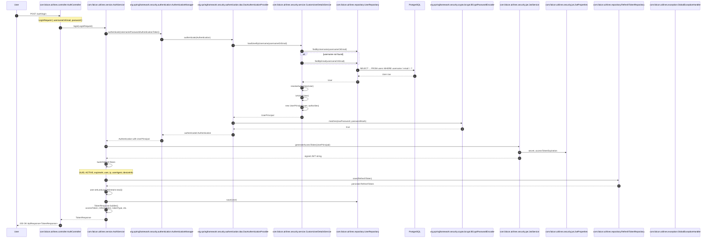
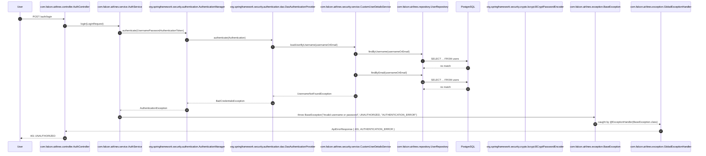

# Authentication Sequence

## Purpose

This document shows the sequence of calls for a successful login and for an
invalid-credentials failure. All class and method names match the actual
Falcon Airlines Enterprise implementation.

## Successful login

## Invalid credentials / user not found

## Component explanations

- **User** — the external HTTP client (web, mobile, API consumer).
- **`AuthController`** — public REST entry point under `/auth`. Receives the
  `LoginRequest`, delegates to `AuthService`, and wraps the result in
  `ApiResponse<TokenResponse>`.
- **`AuthService`** — the application service that orchestrates login. It calls
  the `AuthenticationManager`, builds the JWT access token, creates and persists
  the refresh token, updates `lastLoginAt`, and assembles the `TokenResponse`.
- **`AuthenticationManager`** — Spring Security's central authentication
  coordinator. In this project it is a `ProviderManager` backed by the
  `DaoAuthenticationProvider`.
- **`DaoAuthenticationProvider`** — the provider that retrieves the user through
  `UserDetailsService` and verifies the password with the configured
  `BCryptPasswordEncoder`.
- **`CustomUserDetailsService`** — loads the user by username or email and
  resolves the active `GrantedAuthority` set from roles and permissions.
- **`UserRepository`** — Spring Data JPA repository that executes the SQL
  queries against PostgreSQL through the `User` entity.
- **PostgreSQL** — the underlying relational database that stores users, roles,
  and permissions.
- **`BCryptPasswordEncoder`** — the password hashing implementation that compares
  the raw password with the stored `passwordHash`.
- **`JwtService`** — generates and validates JWTs. During login it builds a
  signed access token containing `sub`, `userId`, and `roles` using the secret
  and expiration from `JwtProperties`.
- **`JwtProperties`** — type-safe configuration record for `jwt.secret`,
  `jwt.accessTokenExpiration`, and `jwt.refreshTokenExpiration`.
- **`RefreshTokenRepository`** — persists the generated refresh token with its
  `token`, `user`, `status`, `expiresAt`, and audit metadata.
- **`GlobalExceptionHandler`** — converts `BaseException` (and other exceptions)
  into the standard `ApiErrorResponse` envelope returned to the client.
