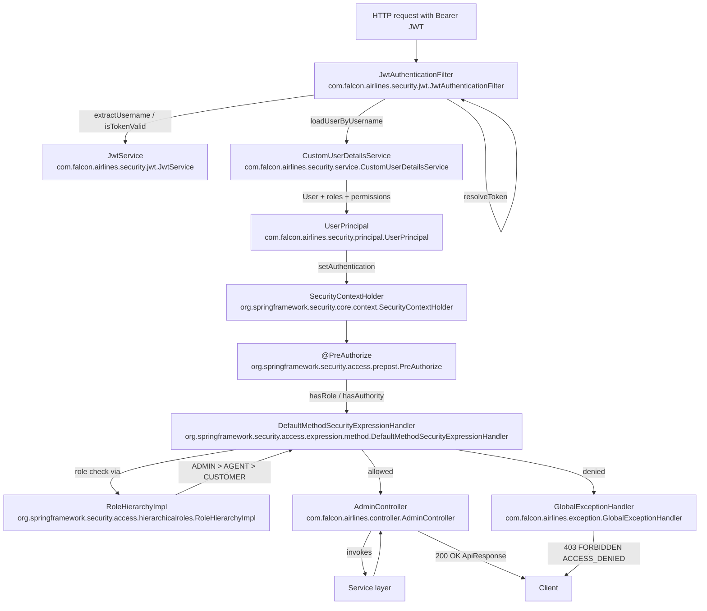
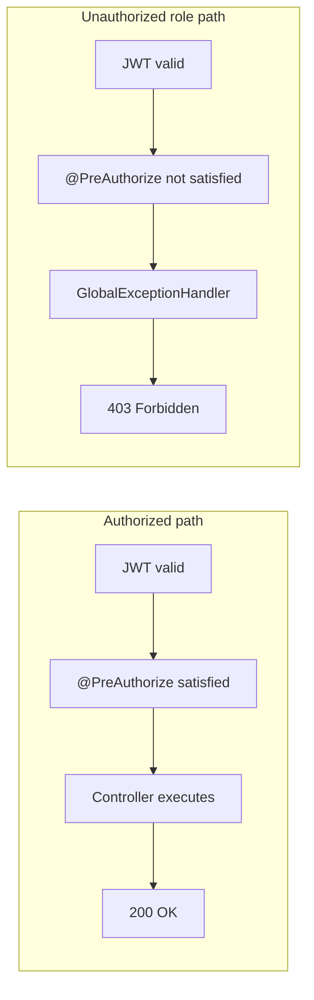

# Authorization Flow

## Purpose

This document describes the authorization flow after a request has passed
authentication. It uses only the actual roles, permissions, and classes
implemented in the Falcon Airlines Enterprise repository.

## Authorization flow diagram



## Authorized vs unauthorized role



## Roles

The application defines three enterprise roles in `com.falcon.airlines.enums.Role`.
They are stored as `ROLE_` prefixed authorities:

| Enum value | Authority string |
|------------|------------------|
| `ADMIN`    | `ROLE_ADMIN`     |
| `AGENT`    | `ROLE_AGENT`     |
| `CUSTOMER` | `ROLE_CUSTOMER`  |

The role hierarchy, configured in `com.falcon.airlines.config.SecurityConfig`,
is:

```
ROLE_ADMIN > ROLE_AGENT
ROLE_AGENT > ROLE_CUSTOMER
```

This means an `ADMIN` user is implicitly granted both `ROLE_AGENT` and
`ROLE_CUSTOMER`, and an `AGENT` user is implicitly granted `ROLE_CUSTOMER`.

The reference seed data in `V3__seed_reference_data.sql` currently assigns all
permissions to the `ADMIN` role.

## Permissions

Fine-grained permissions are defined in `com.falcon.airlines.enums.Permission`.
They are stored as plain authority strings (no `ROLE_` prefix):

- `USER_READ`
- `USER_WRITE`
- `ROLE_READ`
- `ROLE_WRITE`
- `PERMISSION_READ`
- `FLIGHT_READ`
- `FLIGHT_WRITE`
- `BOOKING_READ`
- `BOOKING_WRITE`
- `PASSENGER_READ`
- `PASSENGER_WRITE`
- `PAYMENT_READ`
- `PAYMENT_WRITE`
- `TICKET_READ`
- `TICKET_WRITE`

`CustomUserDetailsService` builds the user's `GrantedAuthority` set by:

1. Adding `ROLE_<roleName>` for every active `UserRole`
2. Adding the permission code (e.g. `BOOKING_READ`) for each permission linked to
   those active roles

## Method-level security example

`com.falcon.airlines.controller.AdminController` demonstrates the two
`@PreAuthorize` styles:

```java
@PreAuthorize("hasRole('ADMIN')")
@GetMapping("/dashboard")
```

```java
@PreAuthorize("hasAnyAuthority('BOOKING_READ', 'BOOKING_WRITE')")
@GetMapping("/bookings")
```

```java
@PreAuthorize("hasRole('CUSTOMER')")
@GetMapping("/customer-area")
```

The `DefaultMethodSecurityExpressionHandler` bean in `SecurityConfig` is wired
with the `RoleHierarchyImpl` bean, so `hasRole` checks are hierarchy-aware.

## 401 Unauthorized vs 403 Forbidden

| Code | Meaning | When it happens in this app |
|------|---------|------------------------------|
| `401 Unauthorized` | The request lacks valid authentication credentials. | Missing, malformed, or expired JWT; empty `SecurityContext`; `JwtAuthenticationFilter` could not establish an `Authentication`. Caught and converted by `GlobalExceptionHandler` (`AuthenticationException` or `BaseException` `AUTHENTICATION_ERROR`). |
| `403 Forbidden` | The client is authenticated, but does not have permission for the resource. | Valid JWT, populated `SecurityContext`, but the `@PreAuthorize` expression denies access (e.g. a `CUSTOMER` calling `AdminController.dashboard()`). `GlobalExceptionHandler` catches `AuthorizationDeniedException` / `AccessDeniedException` and returns `ACCESS_DENIED`. |

## Sequence of an authorized request

1. **JWT validation** — `JwtAuthenticationFilter` extracts the token with
   `JwtTokenUtil`, validates it with `JwtService`, and calls
   `CustomUserDetailsService.loadUserByUsername()`.
2. **Authority resolution** — `CustomUserDetailsService` resolves active roles
   and permissions and wraps them in a `UserPrincipal`.
3. **Security context** — the `UserPrincipal` is placed into
   `SecurityContextHolder`.
4. **Authorization decision** — the request reaches `AdminController` and the
   `MethodSecurityInterceptor` evaluates the `@PreAuthorize` expression. It uses
   `DefaultMethodSecurityExpressionHandler` and `RoleHierarchyImpl` to check the
   authorities.
5. **Controller/service** — if the expression passes, the controller method
   executes and returns `200 OK`.

## Sequence of an unauthorized role request

1. Steps 1–4 above run, so the user is authenticated.
2. The `@PreAuthorize` expression does not match the user's authorities.
3. `AuthorizationDeniedException` (or `AccessDeniedException`) is thrown.
4. `GlobalExceptionHandler` converts it to an `ApiErrorResponse` with
   `HTTP 403 FORBIDDEN` and error code `ACCESS_DENIED`.
