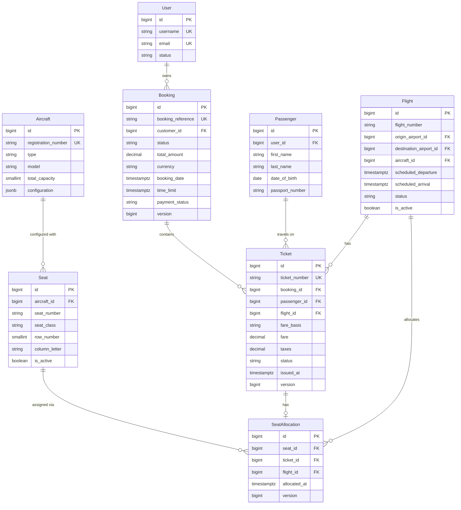

# Booking Domain Model

## Overview

The booking domain is responsible for managing flight reservations, ticket issuance, and seat allocation. It ensures data consistency, prevents overbooking, and maintains the integrity of the booking lifecycle.

## Core Entities

### Booking

The `Booking` entity represents a customer's reservation for one or more passengers on a specific flight.

**Table**: `bookings`

**Key Attributes**:
- `id` (BIGSERIAL) - Primary key
- `booking_reference` (VARCHAR(10), UNIQUE) - Human-readable booking identifier (e.g., "BK12345678")
- `customer_id` (BIGINT, FK → users.id) - The customer who owns the booking
- `status` (VARCHAR(20)) - Booking status: PENDING, CONFIRMED, CANCELLED, COMPLETED
- `total_amount` (DECIMAL(15,2)) - Total fare amount for all tickets
- `currency` (CHAR(3)) - Currency code (e.g., "USD")
- `booking_date` (TIMESTAMPTZ) - When the booking was created
- `time_limit` (TIMESTAMPTZ) - Payment deadline
- `payment_status` (VARCHAR(20)) - Payment status: PENDING, PAID, REFUNDED, FAILED
- `version` (BIGINT) - Optimistic locking version column

**Relationships**:
- `@ManyToOne` to `User` (customer) - LAZY fetch
- `@OneToMany` to `Ticket` (inverse side)

**Constraints**:
- `booking_reference` must be unique
- `total_amount` must be >= 0
- Foreign key to `users` table

**Lifecycle**:
1. Created with status `PENDING`
2. Can be updated to `CONFIRMED` after payment
3. Can be cancelled (status → `CANCELLED`)
4. Cannot be modified after `CONFIRMED` or `CANCELLED`

### Ticket

The `Ticket` entity represents an individual travel document for a passenger on a specific flight.

**Table**: `tickets`

**Key Attributes**:
- `id` (BIGSERIAL) - Primary key
- `ticket_number` (VARCHAR(20), UNIQUE) - Unique ticket identifier (e.g., "TKT1234567890")
- `booking_id` (BIGINT, FK → bookings.id) - Associated booking
- `passenger_id` (BIGINT, FK → passengers.id) - The passenger
- `flight_id` (BIGINT, FK → flights.id) - The flight
- `fare_basis` (VARCHAR(10)) - Fare class code (e.g., "ECONOMY", "BUSINESS")
- `fare` (DECIMAL(15,2)) - Base fare amount
- `taxes` (DECIMAL(15,2)) - Tax amount
- `status` (VARCHAR(20)) - Ticket status: ISSUED, VOID, REFUNDED
- `issued_at` (TIMESTAMPTZ) - When the ticket was issued
- `version` (BIGINT) - Optimistic locking version column

**Relationships**:
- `@ManyToOne` to `Booking` - LAZY fetch
- `@ManyToOne` to `Passenger` - LAZY fetch
- `@ManyToOne` to `Flight` - LAZY fetch
- `@OneToOne` to `SeatAllocation` (inverse side)

**Constraints**:
- `ticket_number` must be unique
- Foreign keys to `bookings`, `passengers`, `flights` tables

**Lifecycle**:
1. Created with status `ISSUED` when booking is confirmed
2. Can be voided (status → `VOID`) when booking is cancelled
3. Can be refunded (status → `REFUNDED`) after payment

### SeatAllocation

The `SeatAllocation` entity represents the assignment of a specific seat to a ticket on a specific flight.

**Table**: `seat_allocations`

**Key Attributes**:
- `id` (BIGSERIAL) - Primary key
- `seat_id` (BIGINT, FK → seats.id) - The allocated seat
- `ticket_id` (BIGINT, FK → tickets.id) - The associated ticket
- `flight_id` (BIGINT, FK → flights.id) - The flight
- `allocated_at` (TIMESTAMPTZ) - When the seat was allocated
- `version` (BIGINT) - Optimistic locking version column

**Relationships**:
- `@ManyToOne` to `Seat` - LAZY fetch
- `@ManyToOne` to `Ticket` - LAZY fetch
- `@ManyToOne` to `Flight` - LAZY fetch

**Constraints**:
- Unique constraint on `(seat_id, flight_id)` - prevents duplicate seat assignment on same flight
- Unique constraint on `ticket_id` - prevents multiple seats per ticket
- Foreign keys to `seats`, `tickets`, `flights` tables

**Lifecycle**:
1. Created when booking is confirmed and seat is assigned
2. Deleted when booking is cancelled (seat released)

### Seat

The `Seat` entity represents a physical seat on an aircraft.

**Table**: `seats`

**Key Attributes**:
- `id` (BIGSERIAL) - Primary key
- `aircraft_id` (BIGINT, FK → aircraft.id) - The aircraft
- `seat_number` (VARCHAR(10)) - Seat identifier (e.g., "1A", "12F")
- `seat_class` (VARCHAR(20)) - Seat class: ECONOMY, BUSINESS, FIRST
- `row_number` (SMALLINT) - Row number
- `column_letter` (CHAR(1)) - Column letter (A, B, C, etc.)
- `is_active` (BOOLEAN) - Whether the seat is available for booking

**Relationships**:
- `@ManyToOne` to `Aircraft` - LAZY fetch
- `@OneToMany` to `SeatAllocation`

**Constraints**:
- Unique constraint on `(aircraft_id, seat_number)` - prevents duplicate seat numbers per aircraft
- `seat_class` must be one of: ECONOMY, BUSINESS, FIRST
- Foreign key to `aircraft` table

**Lifecycle**:
1. Created when aircraft is configured
2. Can be deactivated (`is_active = false`) for maintenance
3. Never deleted (soft delete only)

## Entity Relationship Diagram

## Database Constraints

### Unique Constraints

1. **bookings.booking_reference** - Ensures each booking has a unique reference
2. **tickets.ticket_number** - Ensures each ticket has a unique number
3. **seats (aircraft_id, seat_number)** - Prevents duplicate seat numbers per aircraft
4. **seat_allocations (seat_id, flight_id)** - **Critical constraint** - Prevents double booking of the same seat on the same flight
5. **seat_allocations.ticket_id** - Ensures each ticket has at most one seat allocation

### Foreign Key Constraints

- `bookings.customer_id` → `users.id`
- `tickets.booking_id` → `bookings.id`
- `tickets.passenger_id` → `passengers.id`
- `tickets.flight_id` → `flights.id`
- `seat_allocations.seat_id` → `seats.id`
- `seat_allocations.ticket_id` → `tickets.id`
- `seat_allocations.flight_id` → `flights.id`
- `seats.aircraft_id` → `aircraft.id`

### Check Constraints

- `bookings.total_amount >= 0`
- `seats.seat_class IN ('ECONOMY', 'BUSINESS', 'FIRST')`

## Soft Delete Pattern

All entities extend `AuditEntity` which includes:
- `deleted_at` (TIMESTAMPTZ) - Timestamp when record was soft deleted
- `is_deleted` (BOOLEAN) - Flag indicating soft delete status

All queries use `@SQLRestriction("is_deleted = false")` to automatically filter out deleted records.

## Optimistic Locking

The following entities use optimistic locking via `@Version`:
- `Booking` - `version` column
- `Ticket` - `version` column
- `SeatAllocation` - `version` column

This prevents lost updates when multiple transactions attempt to modify the same entity concurrently.

## Lazy Loading

All `@ManyToOne` relationships use `FetchType.LAZY` to improve performance by loading related entities only when needed. This requires active Hibernate sessions when accessing lazy-loaded associations.
