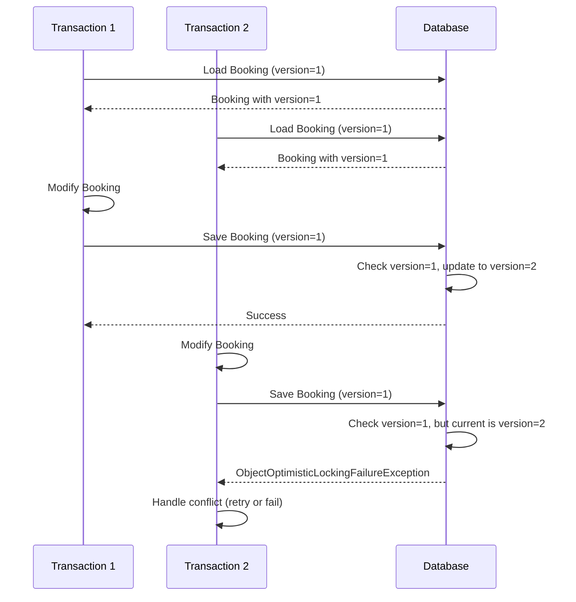
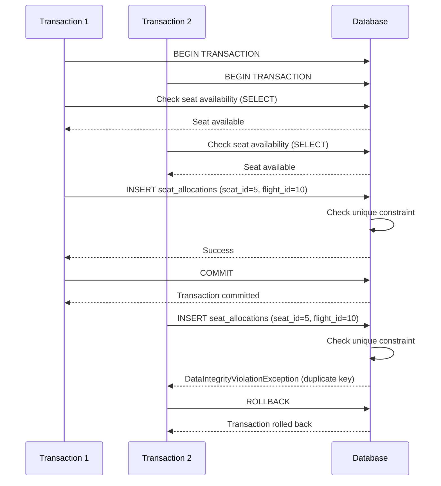
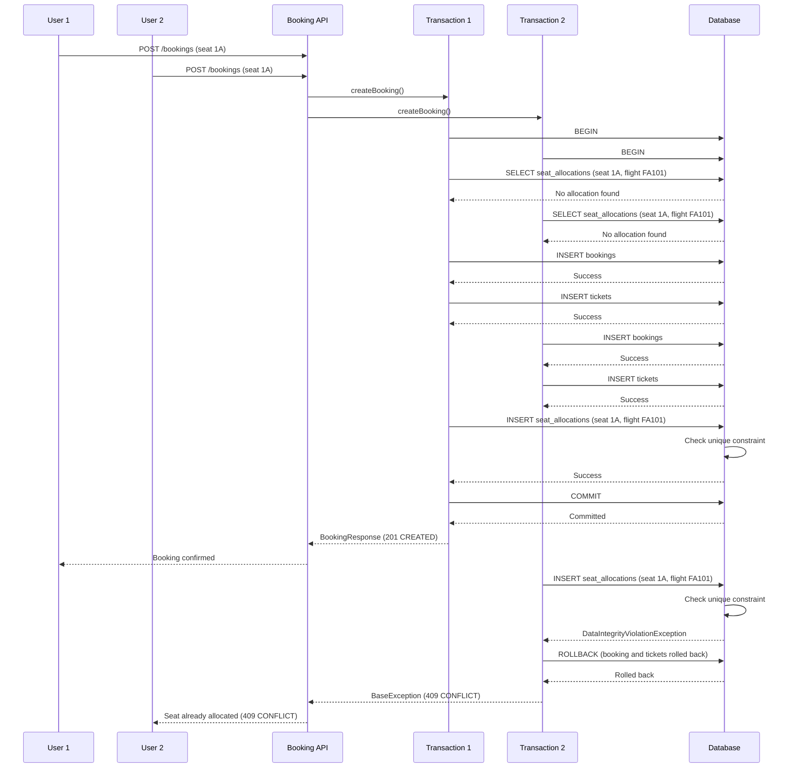

# Booking Locking Strategy

## Overview

The booking engine uses a hybrid locking strategy to prevent overbooking and ensure data consistency during concurrent operations. The primary mechanism is **optimistic locking** combined with **database unique constraints** for critical integrity checks.

## Locking Strategy Summary

| Mechanism | Purpose | Implementation |
|-----------|---------|----------------|
| Optimistic Locking | Prevent lost updates on concurrent modifications | `@Version` on entities |
| Database Unique Constraints | Prevent duplicate seat allocations | `uk_seat_allocations_seat_flight` |
| Application-Level Checks | Early validation before database constraints | `validateSeatsAvailable()` |

## Optimistic Locking

### Implementation

Optimistic locking is implemented using JPA's `@Version` annotation on the following entities:

```java
@Entity
public class Booking extends AuditEntity {
    @Version
    @Column(name = "version", nullable = false)
    private Long version;
}

@Entity
public class Ticket extends AuditEntity {
    @Version
    @Column(name = "version", nullable = false)
    private Long version;
}

@Entity
public class SeatAllocation extends AuditEntity {
    @Version
    @Column(name = "version", nullable = false)
    private Long version;
}
```

### How It Works

1. **Load Phase** - Entity is loaded with version N
2. **Modify Phase** - Application modifies the entity
3. **Save Phase** - Hibernate checks if version is still N
4. **Commit Phase** - If version matches, increment to N+1 and commit
5. **Conflict Phase** - If version doesn't match, throw `ObjectOptimisticLockingFailureException`

### Example Scenario



### Conflict Handling

The booking engine handles optimistic locking failures in the seat assignment operation:

```java
try {
    seatAllocationRepository.save(allocation);
} catch (ObjectOptimisticLockingFailureException e) {
    log.warn("Concurrent seat allocation conflict for seat: {}, flight: {}", seat.getSeatNumber(), flight.getFlightNumber());
    throw new BaseException("Seat was allocated by another transaction. Please try again.", 
            HttpStatus.CONFLICT, "CONCURRENT_ALLOCATION", e);
}
```

**Response**: HTTP 409 CONFLICT with error code `CONCURRENT_ALLOCATION`

## Database Unique Constraints

### Critical Constraint: Seat Allocation

The most important constraint in the booking engine is the unique index on `(seat_id, flight_id)`:

```sql
CREATE UNIQUE INDEX uk_seat_allocations_seat_flight 
ON seat_allocations (seat_id, flight_id) 
WHERE is_deleted = FALSE;
```

**Purpose**: Prevents the same seat from being allocated twice on the same flight.

### How It Prevents Double Booking

When two concurrent transactions attempt to allocate the same seat:



### Application-Level Handling

The booking engine catches the constraint violation and converts it to a business exception:

```java
try {
    seatAllocationRepository.save(allocation);
} catch (DataIntegrityViolationException e) {
    throw new BaseException("Seat " + seat.getSeatNumber() + " is already allocated on this flight", 
            HttpStatus.CONFLICT, "SEAT_ALREADY_ALLOCATED");
}
```

**Response**: HTTP 409 CONFLICT with error code `SEAT_ALREADY_ALLOCATED`

### Other Unique Constraints

1. **uk_seat_allocations_ticket** - Prevents multiple seats per ticket
2. **uk_seats_aircraft_seat** - Prevents duplicate seat numbers per aircraft
3. **bookings.booking_reference** - Prevents duplicate booking references
4. **tickets.ticket_number** - Prevents duplicate ticket numbers

## Application-Level Validation

### Pre-Database Checks

Before attempting database operations, the booking engine performs validation:

```java
private void validateSeatsAvailable(Long flightId, List<Seat> seats) {
    for (Seat seat : seats) {
        boolean isAllocated = seatAllocationRepository.existsBySeatIdAndFlightId(seat.getId(), flightId);
        if (isAllocated) {
            throw new BaseException("Seat already allocated: " + seat.getSeatNumber(), 
                    HttpStatus.CONFLICT, "SEAT_ALREADY_ALLOCATED");
        }
    }
}
```

**Purpose**: 
- Early validation to fail fast
- Reduce database load
- Provide better error messages
- Catch conflicts before transaction commit

### Limitations

Application-level checks alone are insufficient for concurrency control because:
- Check and insert are not atomic
- Race conditions can occur between check and insert
- Multiple transactions can pass the check simultaneously

**Solution**: Database unique constraints provide the final guarantee.

## Why This Strategy Prevents Double Booking

### Multi-Layer Defense

The booking engine uses defense in depth:

1. **Application Check** - Early validation, but not atomic
2. **Database Constraint** - Atomic guarantee at the database level
3. **Transaction Rollback** - Automatic cleanup on constraint violation
4. **Optimistic Locking** - Prevents lost updates on modifications

### Concurrency Scenario

**Scenario**: Two users attempt to book seat 1A on flight FA101 simultaneously



**Result**: Exactly one booking succeeds, one fails with 409 CONFLICT.

## Optimistic vs Pessimistic Locking

### Optimistic Locking (Current Implementation)

**Characteristics**:
- No database locks held during read phase
- Version check at write time
- Better for low-contention scenarios
- Requires version columns on entities

**Pros**:
- No lock contention
- Better performance under low contention
- Simpler to implement
- Works well with web applications

**Cons**:
- Requires retry logic on conflicts
- Can fail after work is done
- Not ideal for high-contention scenarios

**When Used**:
- Booking updates (status changes)
- Ticket modifications
- Seat allocation updates

### Pessimistic Locking (Not Used)

**Characteristics**:
- Database locks held during read phase
- Blocks other transactions
- Better for high-contention scenarios
- Requires `@Lock` annotation or `SELECT FOR UPDATE`

**Pros**:
- Guarantees success if lock acquired
- No retry logic needed
- Predictable behavior

**Cons**:
- Lock contention reduces performance
- Deadlock potential
- More complex to implement
- Can cause cascading delays

**Why Not Used**:
- Booking engine has moderate contention
- Optimistic locking provides sufficient guarantees
- Database unique constraints provide final integrity
- Simpler implementation and better performance

## Concurrency Handling

### Seat Assignment Conflict

When concurrent seat assignments occur:

```java
public void assignSeat(SeatAssignmentRequest request) {
    // ... validation ...
    
    try {
        SeatAllocation allocation = new SeatAllocation();
        allocation.setSeat(seat);
        allocation.setTicket(ticket);
        allocation.setFlight(flight);
        allocation.setAllocatedAt(Instant.now());
        
        seatAllocationRepository.save(allocation);
        
        log.info("Seat assigned successfully: {} to ticket: {}", seat.getSeatNumber(), ticket.getTicketNumber());
    } catch (ObjectOptimisticLockingFailureException e) {
        log.warn("Concurrent seat allocation conflict for seat: {}, flight: {}", seat.getSeatNumber(), flight.getFlightNumber());
        throw new BaseException("Seat was allocated by another transaction. Please try again.", 
                HttpStatus.CONFLICT, "CONCURRENT_ALLOCATION", e);
    }
}
```

**Flow**:
1. Load seat and ticket entities
2. Attempt to save seat allocation
3. If version mismatch, throw optimistic locking exception
4. Convert to business exception with 409 CONFLICT
5. Client can retry or inform user

### Booking Creation Conflict

When concurrent booking creation occurs for the same seat:

```java
try {
    seatAllocationRepository.save(allocation);
} catch (DataIntegrityViolationException e) {
    throw new BaseException("Seat " + seat.getSeatNumber() + " is already allocated on this flight", 
            HttpStatus.CONFLICT, "SEAT_ALREADY_ALLOCATED");
}
```

**Flow**:
1. Create booking and tickets
2. Attempt to allocate seat
3. If unique constraint violated, throw data integrity exception
4. Convert to business exception with 409 CONFLICT
5. Transaction rolls back automatically
6. Client receives 409 CONFLICT

## Locking Performance Considerations

### Optimistic Locking Overhead

- Minimal overhead: version column check on save
- No lock contention during reads
- Only fails on actual concurrent modifications

### Database Constraint Overhead

- Unique index check on insert
- Minimal overhead for low contention
- High overhead only on actual conflicts

### Application Check Overhead

- Additional SELECT query before INSERT
- Reduces unnecessary INSERT attempts
- Provides early feedback

**Overall**: The hybrid strategy provides good performance with strong consistency guarantees.

## Summary

The booking engine's locking strategy:

1. **Primary Defense**: Database unique constraint on `(seat_id, flight_id)` - guarantees no double booking
2. **Secondary Defense**: Optimistic locking on entities - prevents lost updates
3. **Early Validation**: Application-level checks - fail fast and reduce database load
4. **Automatic Rollback**: Transaction management on constraint violations - ensures atomicity

This multi-layer approach ensures data integrity while maintaining good performance for the expected concurrency levels of an airline booking system.
