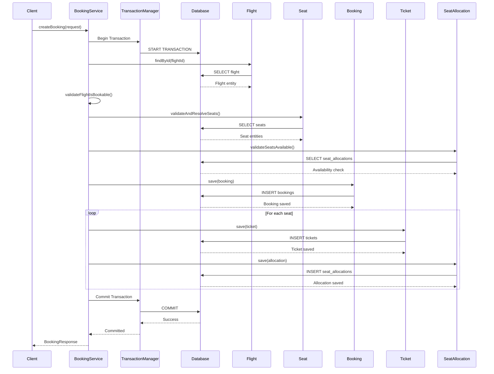

# Booking Transactions

## Overview

The booking engine uses Spring's `@Transactional` annotation to manage database transactions. This ensures ACID properties for all booking operations, particularly the critical booking creation process which involves multiple entity updates.

## Transaction Boundaries

### Class-Level Transaction

The `BookingService` class has a class-level `@Transactional` annotation:

```java
@Service
@Transactional
public class BookingService {
    // All public methods are transactional by default
}
```

This means all public methods in `BookingService` execute within a transaction by default.

### Read-Only Transactions

Methods that only read data are explicitly marked as read-only:

```java
@Transactional(readOnly = true)
public BookingResponse getBooking(Long id) { }

@Transactional(readOnly = true)
public BookingResponse getBookingByReference(String reference) { }

@Transactional(readOnly = true)
public BookingHistoryResponse getBookingHistory(Long customerId, int page, int size) { }

@Transactional(readOnly = true)
public SeatAvailabilityResponse checkSeatAvailability(Long flightId) { }
```

Read-only transactions improve performance by:
- Avoiding dirty checks on entities
- Allowing the database to optimize read operations
- Preventing accidental writes

## Booking Creation Transaction

The `createBooking` method is the most critical transactional operation. It involves multiple entity operations that must succeed or fail atomically:



### Transaction Steps

1. **Begin Transaction** - Spring starts a new database transaction
2. **Validate Flight** - Fetch and validate flight is bookable
3. **Validate Seats** - Fetch seats and check availability
4. **Create Booking** - Insert booking record
5. **Create Tickets** - Insert ticket records (one per passenger)
6. **Allocate Seats** - Insert seat allocation records
7. **Commit Transaction** - All changes are committed atomically

### Rollback Scenarios

The transaction will automatically rollback if any of the following occur:

1. **Validation Failure** - Flight not bookable, seat not available, passenger not found
2. **Constraint Violation** - Duplicate seat allocation (database constraint)
3. **Optimistic Locking Failure** - Concurrent modification of versioned entities
4. **Runtime Exception** - Any uncaught exception during the transaction
5. **Application Error** - Business logic throws `BaseException`

## ACID Properties

### Atomicity

The booking creation operation is atomic - either all entities are created or none are. This is guaranteed by:

- Spring's transaction management
- Database transaction support
- Automatic rollback on exceptions

**Example**: If seat allocation fails due to a duplicate seat constraint, the booking and tickets that were already created are automatically rolled back.

### Consistency

The database remains consistent through:

- **Foreign Key Constraints** - All relationships are valid
- **Unique Constraints** - No duplicate bookings, tickets, or seat allocations
- **Check Constraints** - Valid status values, positive amounts
- **Business Validation** - Flight must be bookable, seats must be available

### Isolation

The booking engine uses the database's default isolation level (typically READ_COMMITTED). This means:

- Uncommitted changes from other transactions are not visible
- Committed changes from other transactions are visible
- Prevents dirty reads but allows non-repeatable reads and phantom reads

**Note**: For concurrent booking scenarios, the database unique constraint on `(seat_id, flight_id)` provides the necessary isolation to prevent double booking.

### Durability

Once a transaction is committed, the changes are durable due to:

- Database write-ahead logging
- Transaction commit guarantees
- ACID-compliant database (PostgreSQL)

## Partial Failure Handling

### Seat Allocation Conflict

The most common partial failure scenario is when two users attempt to book the same seat simultaneously:

```java
try {
    seatAllocationRepository.save(allocation);
} catch (DataIntegrityViolationException e) {
    throw new BaseException("Seat " + seat.getSeatNumber() + " is already allocated on this flight", 
            HttpStatus.CONFLICT, "SEAT_ALREADY_ALLOCATED");
}
```

**Flow**:
1. Transaction begins
2. Booking is created
3. Tickets are created
4. Seat allocation attempt fails due to unique constraint violation
5. `DataIntegrityViolationException` is caught
6. `BaseException` is thrown with HTTP 409 CONFLICT
7. Transaction automatically rolls back
8. Client receives 409 CONFLICT response

### Optimistic Locking Failure

If concurrent updates occur on versioned entities:

```java
try {
    seatAllocationRepository.save(allocation);
} catch (ObjectOptimisticLockingFailureException e) {
    log.warn("Concurrent seat allocation conflict for seat: {}, flight: {}", seat.getSeatNumber(), flight.getFlightNumber());
    throw new BaseException("Seat was allocated by another transaction. Please try again.", HttpStatus.CONFLICT, "CONCURRENT_ALLOCATION", e);
}
```

**Flow**:
1. Transaction begins
2. Entity is loaded with version N
3. Another transaction updates the same entity (version N+1)
4. Current transaction attempts to save with version N
5. `ObjectOptimisticLockingFailureException` is thrown
6. Transaction automatically rolls back
7. Client receives 409 CONFLICT response

## Why Booking is Transactional

### Business Requirements

1. **No Partial Bookings** - A booking must either be fully created or not at all
2. **No Orphaned Tickets** - Tickets cannot exist without a booking
3. **No Unallocated Seats** - Seat allocations must correspond to valid tickets
4. **Accurate Inventory** - Seat availability must be consistent
5. **Financial Integrity** - Payment status must match booking status

### Technical Requirements

1. **Data Consistency** - All related entities must be consistent
2. **Error Recovery** - Automatic rollback on failures
3. **Concurrency Control** - Prevent race conditions
4. **Performance** - Batch operations within a single transaction

### Without Transactions

Without proper transaction management, the following could occur:

- Booking created but tickets fail → orphaned booking
- Tickets created but seat allocation fails → tickets without seats
- Seat allocation succeeds but booking fails → allocated seats without booking
- Concurrent bookings create duplicate seat allocations → overbooking

## Transaction Isolation Concerns

### Thread-Bound Transactions

Spring transactions are thread-bound and are NOT automatically propagated into `CompletableFuture` or `runAsync` threads. This is why integration tests for concurrency must remove class-level `@Transactional` annotations.

**Example**:
```java
// This does NOT work as expected
@Transactional
public void method() {
    CompletableFuture.runAsync(() -> {
        // This runs in a different thread without the transaction
        repository.save(entity);
    });
}
```

### Test Transaction Isolation

Integration tests that test concurrent behavior must:
1. Remove class-level `@Transactional` from test classes
2. Ensure each concurrent operation runs in its own transaction
3. Use proper synchronization primitives (CountDownLatch, CyclicBarrier)
4. Capture exceptions from each concurrent task

### HTTP Request Transactions

For REST endpoints, each HTTP request executes in its own transaction:
- The `@Transactional` on `BookingService` ensures each request has a transaction
- The transaction is committed when the method completes successfully
- The transaction is rolled back if an exception is thrown

## Transaction Propagation

The booking engine uses the default propagation behavior (`REQUIRED`):

- If a transaction exists, join it
- If no transaction exists, create a new one

This is appropriate for the booking engine because:
- Most operations should run in their own transaction
- Nested transactions are not needed for the current use cases
- Simpler transaction management reduces complexity

## Performance Considerations

### Transaction Size

The booking creation transaction includes multiple inserts:
- 1 booking
- N tickets (where N = number of passengers)
- N seat allocations

**Optimization**: Keep transactions as short as possible while maintaining atomicity.

### Lock Duration

Database locks are held for the duration of the transaction:
- Row locks on inserted records
- Potential locks on referenced records (depending on isolation level)

**Optimization**: Minimize time between first database access and commit.

### Read-Only Optimization

Read-only operations are marked as such to allow database optimizations:
- No dirty checking
- No write locks
- Potential query plan optimizations
