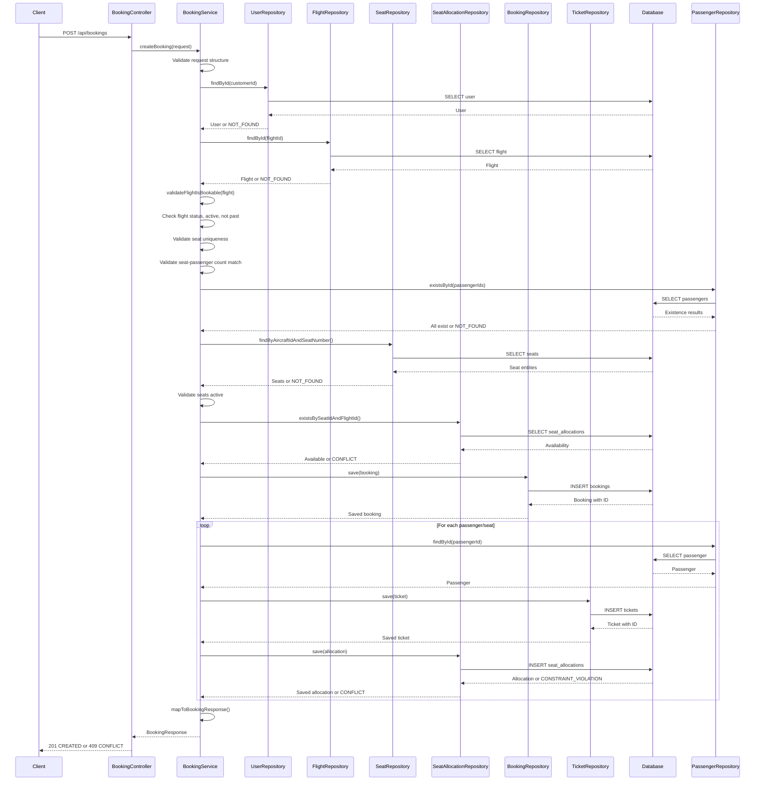
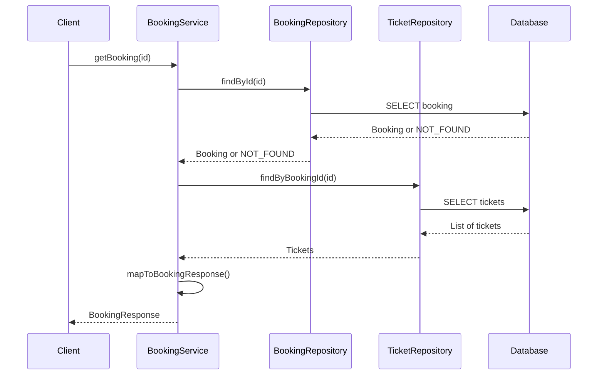
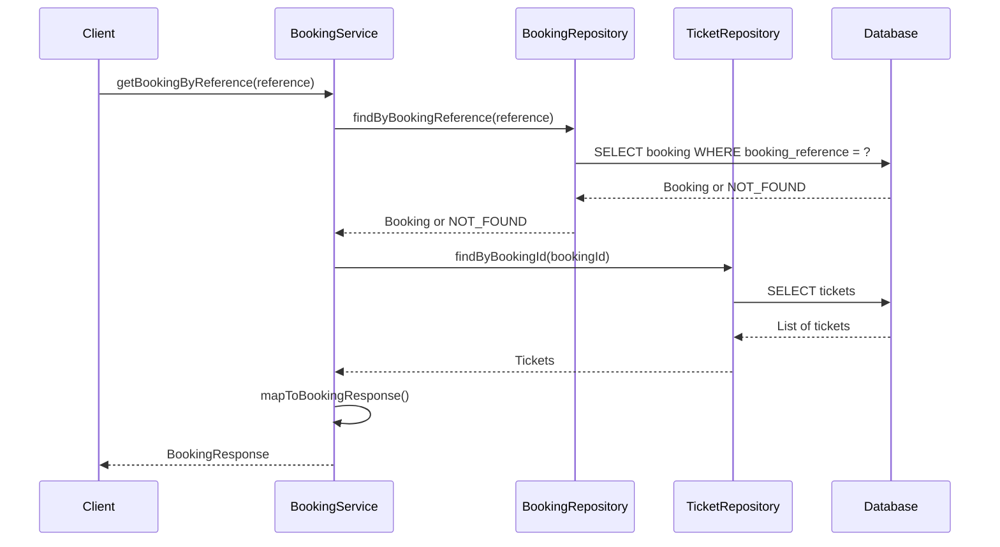
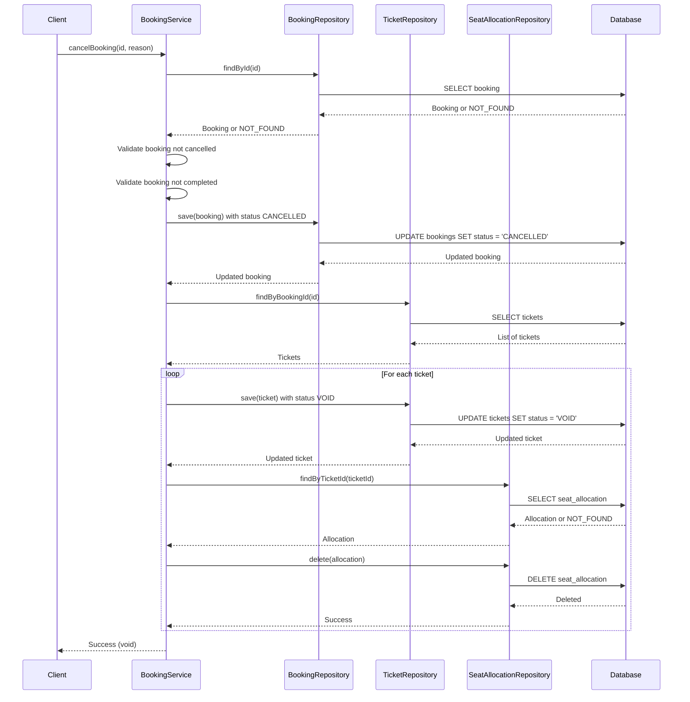
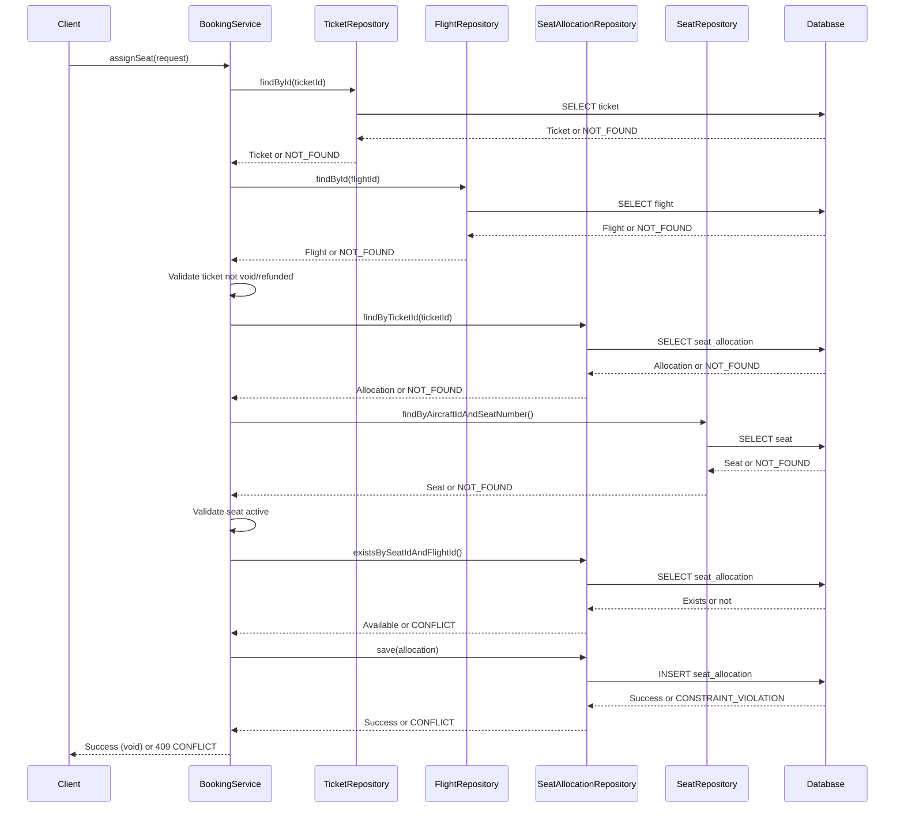
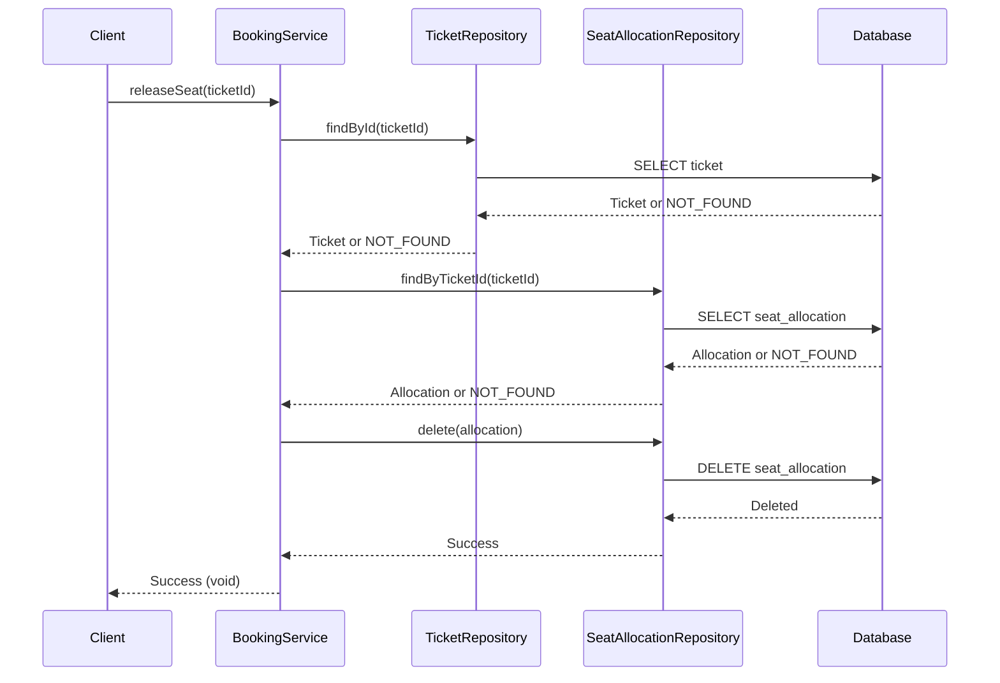
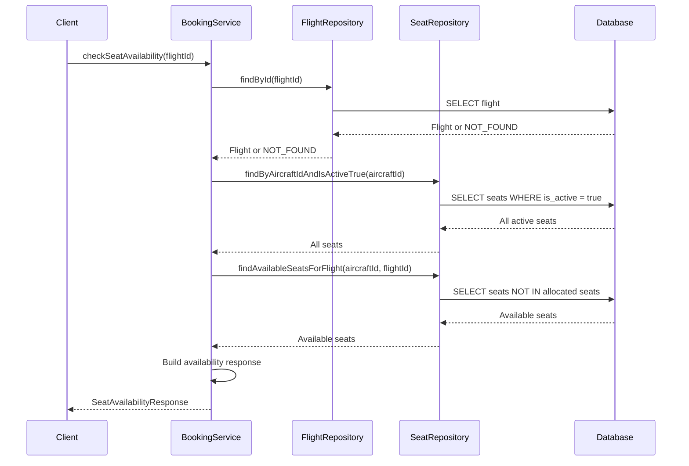

# Booking Workflow

## Overview

The booking workflow defines the end-to-end process of creating, managing, and cancelling flight reservations. This document details the sequence of operations, validation steps, and error handling for each workflow.

## Booking Creation Workflow

### Request Flow



### Validation Steps

1. **Request Structure Validation**
   - Customer ID must be valid
   - Flight ID must be valid
   - Requested seats must not contain duplicates
   - Number of seats must match number of passengers

2. **Customer Validation**
   - Customer must exist in database
   - Error: `CUSTOMER_NOT_FOUND` (404 NOT_FOUND)

3. **Flight Validation**
   - Flight must exist in database
   - Flight status must not be CANCELLED
   - Flight must be active for booking
   - Flight must not be in the past
   - Errors: `FLIGHT_NOT_FOUND` (404), `FLIGHT-cancelled` (400), `FLIGHT_INACTIVE` (400), `FLIGHT_IN_PAST` (400)

4. **Passenger Validation**
   - All passengers must exist in database
   - Error: `PASSENGER_NOT_FOUND` (404 NOT_FOUND)

5. **Seat Validation**
   - All seats must exist on the aircraft
   - All seats must be active
   - Errors: `SEAT_NOT_FOUND` (404), `SEAT_INACTIVE` (400)

6. **Seat Availability Validation**
   - All seats must be available for the flight
   - Error: `SEAT_ALREADY_ALLOCATED` (409 CONFLICT)

### Creation Steps

1. **Create Booking**
   - Generate unique booking reference (e.g., "BK12345678")
   - Set status to PENDING
   - Set payment status to PENDING
   - Calculate total amount from seat fares
   - Save to database

2. **Create Tickets**
   - For each passenger/seat pair:
     - Generate unique ticket number (e.g., "TKT1234567890")
     - Link to booking and passenger
     - Set fare based on seat class
     - Calculate taxes (20% of fare)
     - Set status to ISSUED
     - Save to database

3. **Allocate Seats**
   - For each ticket:
     - Create seat allocation
     - Link seat, ticket, and flight
     - Set allocation timestamp
     - Save to database
     - Handle constraint violation (409 CONFLICT)

### Success Response

```json
{
  "id": 1,
  "bookingReference": "BK12345678",
  "customerId": 5,
  "customerUsername": "john.doe",
  "flightId": 10,
  "flightNumber": "FA101",
  "status": "PENDING",
  "totalAmount": 120.00,
  "currency": "USD",
  "bookingDate": "2026-08-14T10:00:00Z",
  "timeLimit": null,
  "paymentStatus": "PENDING",
  "version": 0,
  "tickets": [
    {
      "id": 1,
      "ticketNumber": "TKT1234567890",
      "passengerId": 3,
      "passengerName": "John Doe",
      "flightId": 10,
      "flightNumber": "FA101",
      "fareBasis": "ECONOMY",
      "fare": 100.00,
      "taxes": 20.00,
      "status": "ISSUED",
      "issuedAt": "2026-08-14T10:00:00Z",
      "seatNumber": "1A",
      "seatClass": "ECONOMY"
    }
  ]
}
```

### Failure Scenarios

| Scenario | HTTP Status | Error Code | Description |
|----------|-------------|------------|-------------|
| Customer not found | 404 | CUSTOMER_NOT_FOUND | Customer ID does not exist |
| Flight not found | 404 | FLIGHT_NOT_FOUND | Flight ID does not exist |
| Flight cancelled | 400 | FLIGHT_CANCELLED | Flight status is CANCELLED |
| Flight inactive | 400 | FLIGHT_INACTIVE | Flight is not active for booking |
| Flight in past | 400 | FLIGHT_IN_PAST | Cannot book past flights |
| Duplicate seats | 400 | DUPLICATE_SEATS_IN_REQUEST | Same seat requested multiple times |
| Seat-passenger mismatch | 400 | SEAT_PASSENGER_MISMATCH | Seat count doesn't match passenger count |
| Passenger not found | 404 | PASSENGER_NOT_FOUND | Passenger ID does not exist |
| Seat not found | 404 | SEAT_NOT_FOUND | Seat does not exist on aircraft |
| Seat inactive | 400 | SEAT_INACTIVE | Seat is not active |
| Seat already allocated | 409 | SEAT_ALREADY_ALLOCATED | Seat is already booked on this flight |

## Booking Retrieval Workflow

### By ID



### By Reference



## Booking Cancellation Workflow

### Cancellation Flow



### Cancellation Validation

1. **Booking Existence**
   - Booking must exist
   - Error: `BOOKING_NOT_FOUND` (404 NOT_FOUND)

2. **Booking Status**
   - Booking must not already be cancelled
   - Booking must not be completed
   - Errors: `BOOKING_ALREADY_CANCELLED` (400), `BOOKING_ALREADY_COMPLETED` (400)

### Cancellation Steps

1. **Update Booking Status**
   - Set status to CANCELLED
   - Save to database

2. **Void Tickets**
   - For each ticket in the booking:
     - Set status to VOID
     - Save to database

3. **Release Seats**
   - For each ticket:
     - Find seat allocation
     - Delete seat allocation
     - Seat becomes available for booking

### Failure Scenarios

| Scenario | HTTP Status | Error Code | Description |
|----------|-------------|------------|-------------|
| Booking not found | 404 | BOOKING_NOT_FOUND | Booking ID does not exist |
| Already cancelled | 400 | BOOKING_ALREADY_CANCELLED | Booking is already cancelled |
| Already completed | 400 | BOOKING_ALREADY_COMPLETED | Cannot cancel completed booking |

## Seat Assignment Workflow

### Assignment Flow



### Assignment Validation

1. **Ticket Validation**
   - Ticket must exist
   - Ticket status must not be VOID or REFUNDED
   - Ticket must not already have a seat assigned
   - Errors: `TICKET_NOT_FOUND` (404), `TICKET_INVALID` (400), `SEAT_ALREADY_ASSIGNED` (409)

2. **Flight Validation**
   - Flight must exist
   - Error: `FLIGHT_NOT_FOUND` (404)

*3. **Seat Validation**
   - Seat must exist on aircraft
   - Seat must be active
   - Seat must not be allocated for this flight
   - Errors: `SEAT_NOT_FOUND` (404), `SEAT_INACTIVE` (400), `SEAT_ALREADY_ALLOCATED` (409)

### Assignment Steps

1. **Validate Ticket**
   - Check ticket exists and is valid
   - Check ticket doesn't already have a seat

2. **Validate Seat**
   - Find seat on aircraft
   - Check seat is active
   - Check seat is available for flight

3. **Create Allocation**
   - Create seat allocation
   - Link seat, ticket, and flight
   - Save to database
   - Handle optimistic locking conflicts

### Failure Scenarios

| Scenario | HTTP Status | Error Code | Description |
|----------|-------------|------------|-------------|
| Ticket not found | 404 | TICKET_NOT_FOUND | Ticket ID does not exist |
| Invalid ticket status | 400 | TICKET_INVALID | Ticket is void or refunded |
| Seat already assigned | 409 | SEAT_ALREADY_ASSIGNED | Ticket already has a seat |
| Flight not found | 404 | FLIGHT_NOT_FOUND | Flight ID does not exist |
| Seat not found | 404 | SEAT_NOT_FOUND | Seat does not exist on aircraft |
| Seat inactive | 400 | SEAT_INACTIVE | Seat is not active |
| Seat already allocated | 409 | SEAT_ALREADY_ALLOCATED | Seat is already booked on this flight |
| Concurrent allocation | 409 | CONCURRENT_ALLOCATION | Seat allocated by another transaction |

## Seat Release Workflow

### Release Flow



### Release Validation

1. **Ticket Validation**
   - Ticket must exist
   - Error: `TICKET_NOT_FOUND` (404 NOT_FOUND)

2. **Allocation Validation**
   - Seat allocation must exist for ticket
   - Error: `SEAT_ALLOCATION_NOT_FOUND` (404 NOT_FOUND)

### Release Steps

1. **Find Allocation**
   - Find seat allocation by ticket ID

2. **Delete Allocation**
   - Delete seat allocation
   - Seat becomes available for booking

### Failure Scenarios

| Scenario | HTTP Status | Error Code | Description |
|----------|-------------|------------|-------------|
| Ticket not found | 404 | TICKET_NOT_FOUND | Ticket ID does not exist |
| Allocation not found | 404 | SEAT_ALLOCATION_NOT_FOUND | No seat allocation for ticket |

## Seat Availability Check Workflow

### Check Flow



### Check Steps

1. **Fetch Flight**
   - Get flight by ID
   - Error if not found

2. **Fetch All Seats**
   - Get all active seats for aircraft

3. **Fetch Available Seats**
   - Get seats not allocated for this flight

4. **Build Response**
   - Mark each seat as available or not
   - Include seat details

### Success Response

```json
{
  "flightId": 10,
  "flightNumber": "FA101",
  "aircraftId": 1,
  "aircraftRegistrationNumber": "N12345",
  "totalSeats": 150,
  "availableSeats": 145,
  "seats": [
    {
      "seatId": 1,
      "seatNumber": "1A",
      "seatClass": "FIRST",
      "rowNumber": 1,
      "columnLetter": "A",
      "isAvailable": true,
      "isActive": true
    },
    {
      "seatId": 2,
      "seatNumber": "1B",
      "seatClass": "FIRST",
      "rowNumber": 1,
      "columnLetter": "B",
      "isAvailable": false,
      "isActive": true
    }
  ]
}
```

## Error Handling Strategy

### Validation Errors

Validation errors occur before any database modifications:
- Return 400 BAD_REQUEST or 404 NOT_FOUND
- No transaction rollback needed
- Client can retry with corrected data

### Constraint Violations

Constraint violations occur during database operations:
- Return 409 CONFLICT
- Transaction automatically rolls back
- Client should not retry without changes

### Optimistic Locking Failures

Optimistic locking failures occur on concurrent modifications:
- Return 409 CONFLICT
- Transaction automatically rolls back
- Client can retry after fetching fresh data

## Transaction Rollback Scenarios

### Automatic Rollback

Transactions automatically rollback on:
- Any uncaught exception
- `DataIntegrityViolationException` (constraint violation)
- `ObjectOptimisticLockingFailureException` (version mismatch)
- `BaseException` (business exception)

### Manual Rollback

No manual rollback is needed in the booking engine:
- Spring's `@Transactional` handles automatic rollback
- All exceptions trigger rollback
- No programmatic rollback required

## Summary

The booking workflow ensures:

1. **Data Integrity** - All validations before database operations
2. **Atomicity** - All operations in a single transaction
3. **Consistency** - Database constraints enforce rules
4. **Isolation** - Transactions are isolated from each other
5. **Durability** - Committed changes are permanent

The workflow handles all error scenarios gracefully, providing clear error codes and HTTP status codes to clients.
