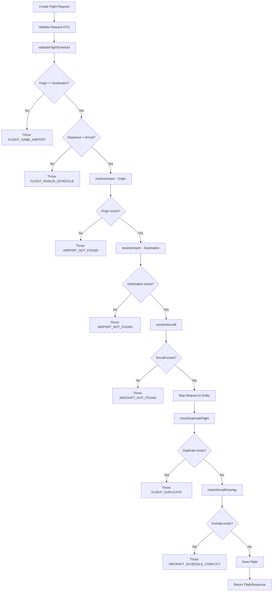

# Flight Inventory

## Overview
The Flight Inventory domain manages the core flight scheduling operations for Falcon Airlines. It handles the creation, retrieval, update, deletion, and search of flights with comprehensive validation, duplicate prevention, and aircraft schedule conflict detection. Flights represent scheduled air travel between airports using specific aircraft.

## Flight Entity
The `Flight` entity is defined in `com.falcon.airlines.entity.Flight`. It extends `AuditEntity` for audit trail support.

```java
@Entity
@Table(name = "flights")
@SQLRestriction("is_deleted = false")
public class Flight extends AuditEntity
```

### Entity Fields

| Field | Type | Database Column | Nullable | Description |
|-------|------|-----------------|----------|-------------|
| id | Long | id | No | Primary key (auto-generated) |
| flightNumber | String | flight_number | No | Flight identifier (max 10 chars) |
| originAirport | Airport | origin_airport_id | No | Origin airport (FK) |
| destinationAirport | Airport | destination_airport_id | No | Destination airport (FK) |
| aircraft | Aircraft | aircraft_id | No | Assigned aircraft (FK) |
| scheduledDeparture | Instant | scheduled_departure | No | Scheduled departure time |
| scheduledArrival | Instant | scheduled_arrival | No | Scheduled arrival time |
| status | FlightStatus | status | No | Flight status enum |
| terminal | String | terminal | Yes | Departure terminal (max 10 chars) |
| gate | String | gate | Yes | Departure gate (max 10 chars) |
| isActive | Boolean | is_active | No | Whether flight is active |

## Airport Relationship
Flight has two `@ManyToOne` relationships to Airport:

```java
@ManyToOne(fetch = FetchType.LAZY)
@JoinColumn(name = "origin_airport_id", nullable = false)
private Airport originAirport;

@ManyToOne(fetch = FetchType.LAZY)
@JoinColumn(name = "destination_airport_id", nullable = false)
private Airport destinationAirport;
```

- **Cardinality**: Many flights can originate from or arrive at one airport
- **Owning side**: Flight is the owning side (contains `@JoinColumn`)
- **Foreign key**: `origin_airport_id` and `destination_airport_id` in flights table
- **Fetch strategy**: LAZY to avoid unnecessary loading
- **Nullable**: false - both airports are required
- **Cascade**: None - airports are managed independently
- **Referential integrity**: Database FK constraint ensures airports exist

## Aircraft Relationship
Flight has a `@ManyToOne` relationship to Aircraft:

```java
@ManyToOne(fetch = FetchType.LAZY)
@JoinColumn(name = "aircraft_id", nullable = false)
private Aircraft aircraft;
```

- **Cardinality**: Many flights can use one aircraft over time
- **Owning side**: Flight is the owning side
- **Foreign key**: `aircraft_id` in flights table
- **Fetch strategy**: LAZY
- **Nullable**: false - aircraft is required
- **Cascade**: None - aircraft is managed independently
- **Referential integrity**: Database FK constraint ensures aircraft exists

## Flight Lifecycle
Flight status is managed through the `FlightStatus` enum:

```java
public enum FlightStatus {
    SCHEDULED,
    DELAYED,
    CANCELLED,
    BOARDING,
    DEPARTED,
    ARRIVED
}
```

The lifecycle progression typically follows:
1. **SCHEDULED** → Initial state when flight is created
2. **DELAYED** → When departure is postponed
3. **BOARDING** → When passengers are boarding
4. **DEPARTED** → When flight takes off
5. **ARRIVED** → When flight lands
6. **CANCELLED** → When flight is cancelled (can happen from any state)

## CRUD

### Create
- **Endpoint**: `POST /api/flights`
- **Controller**: `FlightController.createFlight()`
- **Service**: `FlightService.createFlight()`
- **Authorization**: `@PreAuthorize("hasAnyAuthority('FLIGHT_WRITE')")`
- **Validation**: `@Valid` on `FlightRequest`
- **Response**: `201 CREATED` with `FlightResponse`

### Read (by ID)
- **Endpoint**: `GET /api/flights/{id}`
- **Controller**: `FlightController.getFlightById()`
- **Service**: `FlightService.getFlightById()`
- **Authorization**: `@PreAuthorize("hasAnyAuthority('FLIGHT_READ')")`
- **Response**: `200 OK` with `FlightResponse`
- **Error**: `404 NOT_FOUND` if flight does not exist

### Update
- **Endpoint**: `PUT /api/flights/{id}`
- **Controller**: `FlightController.updateFlight()`
- **Service**: `FlightService.updateFlight()`
- **Authorization**: `@PreAuthorize("hasAnyAuthority('FLIGHT_WRITE')")`
- **Validation**: `@Valid` on `FlightRequest`
- **Response**: `200 OK` with `FlightResponse`
- **Error**: `404 NOT_FOUND` if flight does not exist, `409 CONFLICT` for duplicates or conflicts

### Delete
- **Endpoint**: `DELETE /api/flights/{id}`
- **Controller**: `FlightController.deleteFlight()`
- **Service**: `FlightService.deleteFlight()`
- **Authorization**: `@PreAuthorize("hasAnyAuthority('FLIGHT_WRITE')")`
- **Implementation**: Soft delete - sets `isActive = false`, `isDeleted = true`, `deletedAt = now()`
- **Response**: `200 OK`

## Search
Flight search is implemented via `FlightService.searchFlights()` using JPA Specifications:

### Search Parameters
- **flightNumber**: Partial match on flight number (case-insensitive)
- **originAirport**: Exact match on origin airport IATA code
- **destinationAirport**: Exact match on destination airport IATA code
- **aircraft**: Exact match on aircraft registration number
- **status**: Exact match on flight status
- **departureFrom**: Flights departing on or after this time
- **departureTo**: Flights departing on or before this time
- **active**: Filter by active status (exact match)

### Implementation
The `buildSpecification()` method constructs dynamic queries:

```java
Specification<Flight> spec = (root, query, cb) -> cb.equal(root.get("isDeleted"), false);

if (flightNumber != null && !flightNumber.isBlank()) {
    String like = "%" + flightNumber.toLowerCase() + "%";
    spec = spec.and((root, query, cb) -> cb.like(cb.lower(root.get("flightNumber")), like));
}

if (originAirport != null && !originAirport.isBlank()) {
    spec = spec.and((root, query, cb) -> cb.equal(root.get("originAirport").get("iataCode"), originAirport));
}

if (destinationAirport != null && !destinationAirport.isBlank()) {
    spec = spec.and((root, query, cb) -> cb.equal(root.get("destinationAirport").get("iataCode"), destinationAirport));
}

if (aircraft != null && !aircraft.isBlank()) {
    spec = spec.and((root, query, cb) -> cb.equal(root.get("aircraft").get("registrationNumber"), aircraft));
}
```

Airport and aircraft filters navigate the relationship using `root.get("originAirport").get("iataCode")`.

## Filtering
Filtering is integrated into the search functionality through the Specification-based implementation. Each search parameter acts as a filter:

- **Text filters**: flightNumber uses LIKE for partial matching
- **Exact filters**: originAirport, destinationAirport, aircraft, status, active use equality
- **Range filters**: departureFrom and departureTo use >= and <= operators

## Pagination
Pagination is handled through Spring Data's `Pageable` interface:

- **Endpoint**: `GET /api/flights` with query parameters `page`, `size`, `sort`
- **Controller**: Accepts `Pageable` parameter
- **Service**: Returns `Page<FlightResponse>`
- **Repository**: Uses `JpaSpecificationExecutor<Flight>.findAll(spec, pageable)`

The `FlightRepository` extends both `JpaRepository` and `JpaSpecificationExecutor` to support pagination with dynamic specifications.

## Sorting
Sorting is supported through the `Pageable` parameter:

- **Sortable fields**: Any entity field can be sorted (flightNumber, scheduledDeparture, status, etc.)
- **Default sort**: None specified - relies on client-provided sort parameters
- **Example**: `GET /api/flights?sort=scheduledDeparture,desc`

## Flight Validation
Flight validation is performed in `FlightService.validateFlightSchedule()`:

### 1. Origin/Destination Airport Validation
```java
if (request.getOriginAirportId().equals(request.getDestinationAirportId())) {
    throw new BaseException("Departure and arrival airports must be different", 
        HttpStatus.BAD_REQUEST, "FLIGHT_SAME_AIRPORT");
}
```

### 2. Schedule Time Validation
```java
if (request.getScheduledDeparture().equals(request.getScheduledArrival())) {
    throw new BaseException("Departure and arrival times cannot be the same", 
        HttpStatus.BAD_REQUEST, "FLIGHT_SAME_TIME");
}

if (request.getScheduledDeparture().isAfter(request.getScheduledArrival())) {
    throw new BaseException("Departure time must be before arrival time", 
        HttpStatus.BAD_REQUEST, "FLIGHT_INVALID_SCHEDULE");
}
```

### 3. Airport Existence Validation
```java
private Airport resolveAirport(Long id, String label) {
    return airportRepository.findById(id)
        .orElseThrow(() -> new BaseException(label + " airport not found", 
            HttpStatus.NOT_FOUND, "AIRPORT_NOT_FOUND"));
}
```

### 4. Aircraft Existence Validation
```java
private Aircraft resolveAircraft(Long id) {
    return aircraftRepository.findById(id)
        .orElseThrow(() -> new BaseException("Aircraft not found", 
            HttpStatus.NOT_FOUND, "AIRCRAFT_NOT_FOUND"));
}
```

## Schedule Validation
Schedule validation ensures logical flight timing:

- **Departure before arrival**: Scheduled departure must be before scheduled arrival
- **Different times**: Departure and arrival cannot be at the same time
- **Different airports**: Origin and destination must be different airports

## Duplicate Prevention
Duplicate flight detection is implemented in `FlightService.checkDuplicateFlight()`:

```java
private void checkDuplicateFlight(String flightNumber, Instant scheduledDeparture, Long excludeId) {
    Optional<Flight> duplicate;
    if (excludeId == null) {
        duplicate = flightRepository.findByFlightNumberAndScheduledDeparture(flightNumber, scheduledDeparture);
    } else {
        duplicate = flightRepository.findByFlightNumberAndScheduledDepartureAndIdNot(
            flightNumber, scheduledDeparture, excludeId);
    }

    duplicate.ifPresent(f -> {
        throw new BaseException("Duplicate flight: a flight with number " + flightNumber + 
            " and the same departure time already exists",
            HttpStatus.CONFLICT, "FLIGHT_DUPLICATE");
    });
}
```

**Definition of duplicate**: A flight with the same flight number AND the same scheduled departure time.

**Repository methods**:
- `findByFlightNumberAndScheduledDeparture()` - for create operations
- `findByFlightNumberAndScheduledDepartureAndIdNot()` - for update operations (excludes current record)

## Repository
`FlightRepository` provides the following custom methods:

```java
public interface FlightRepository extends JpaRepository<Flight, Long>, JpaSpecificationExecutor<Flight> {
    Optional<Flight> findByFlightNumber(String flightNumber);
    List<Flight> findByOriginAirportIdAndDestinationAirportId(Long originId, Long destinationId);
    boolean existsByOriginAirportIdAndIsActiveTrue(Long originAirportId);
    boolean existsByDestinationAirportIdAndIsActiveTrue(Long destinationAirportId);
    boolean existsByAircraftIdAndIsActiveTrue(Long aircraftId);
    Optional<Flight> findByFlightNumberAndScheduledDeparture(String flightNumber, Instant scheduledDeparture);
    Optional<Flight> findByFlightNumberAndScheduledDepartureAndIdNot(String flightNumber, Instant scheduledDeparture, Long id);
    List<Flight> findByAircraftIdAndScheduledArrivalGreaterThanAndScheduledDepartureLessThanAndIsActiveTrue(
        Long aircraftId, Instant newDeparture, Instant newArrival);
    List<Flight> findByAircraftIdAndScheduledArrivalGreaterThanAndScheduledDepartureLessThanAndIsActiveTrueAndIdNot(
        Long aircraftId, Instant newDeparture, Instant newArrival, Long id);
}
```

## Service
`FlightService` contains all business logic:

- **createFlight()**: Validates schedule, resolves entities, checks duplicates, checks overlap, saves
- **getFlightById()**: Fetches by ID, throws if not found
- **updateFlight()**: Validates schedule, resolves entities, checks duplicates, checks overlap, updates
- **deleteFlight()**: Performs soft delete
- **listFlights()**: Delegates to search with null filters
- **searchFlights()**: Builds specification, queries with pagination
- **validateFlightSchedule()**: Validates airport and schedule constraints
- **resolveAirport()**: Fetches airport or throws not found
- **resolveAircraft()**: Fetches aircraft or throws not found
- **checkDuplicateFlight()**: Prevents duplicate flights
- **checkAircraftOverlap()**: Prevents aircraft schedule conflicts
- **buildSpecification()**: Constructs dynamic JPA Specification

## Controller
`FlightController` exposes REST endpoints:

```java
@RestController
@RequestMapping("/api/flights")
@Tag(name = "Flight Management", description = "Flight CRUD, search and scheduling operations")
public class FlightController {
    @GetMapping
    @PreAuthorize("hasAnyAuthority('FLIGHT_READ')")
    public ResponseEntity<ApiResponse<Page<FlightResponse>>> searchFlights(...)

    @GetMapping("/{id}")
    @PreAuthorize("hasAnyAuthority('FLIGHT_READ')")
    public ResponseEntity<ApiResponse<FlightResponse>> getFlightById(@PathVariable Long id)

    @PostMapping
    @PreAuthorize("hasAnyAuthority('FLIGHT_WRITE')")
    public ResponseEntity<ApiResponse<FlightResponse>> createFlight(@Valid @RequestBody FlightRequest request)

    @PutMapping("/{id}")
    @PreAuthorize("hasAnyAuthority('FLIGHT_WRITE')")
    public ResponseEntity<ApiResponse<FlightResponse>> updateFlight(...)

    @DeleteMapping("/{id}")
    @PreAuthorize("hasAnyAuthority('FLIGHT_WRITE')")
    public ResponseEntity<ApiResponse<String>> deleteFlight(@PathVariable Long id)
}
```

All endpoints are protected with JWT authentication (`@SecurityRequirement(name = "bearerAuth")`) and method-level security annotations.

## Database Persistence
The flights table is defined in the Flyway migration `V2__create_schema.sql`:

```sql
CREATE TABLE IF NOT EXISTS flights (
    id BIGSERIAL PRIMARY KEY,
    flight_number VARCHAR(10) NOT NULL,
    origin_airport_id BIGINT NOT NULL REFERENCES airports(id),
    destination_airport_id BIGINT NOT NULL REFERENCES airports(id),
    aircraft_id BIGINT NOT NULL REFERENCES aircraft(id),
    scheduled_departure TIMESTAMPTZ NOT NULL,
    scheduled_arrival TIMESTAMPTZ NOT NULL,
    status VARCHAR(20) NOT NULL,
    terminal VARCHAR(10),
    gate VARCHAR(10),
    is_active BOOLEAN NOT NULL DEFAULT TRUE,
    created_at TIMESTAMPTZ NOT NULL DEFAULT now(),
    updated_at TIMESTAMPTZ NOT NULL DEFAULT now(),
    created_by BIGINT REFERENCES users(id),
    updated_by BIGINT REFERENCES users(id),
    deleted_at TIMESTAMPTZ,
    is_deleted BOOLEAN NOT NULL DEFAULT FALSE
);
```

Indexes supporting flight queries:
- `idx_flights_search` on (origin_airport_id, destination_airport_id, scheduled_departure)
- `idx_flights_aircraft` on (aircraft_id)
- `idx_flights_status` on (status)
- `idx_flights_active` partial index on (is_active) WHERE is_active = TRUE AND is_deleted = FALSE

## Security

### Authentication
All endpoints require JWT authentication. The `JwtAuthenticationFilter` validates the Bearer token and sets up the Spring Security context.

### Authorization
- **Read operations** (GET): Require `FLIGHT_READ` authority
  - Accessible by users with roles that include `FLIGHT_READ` permission (ADMIN, AGENT, CUSTOMER)
- **Write operations** (POST, PUT, DELETE): Require `FLIGHT_WRITE` authority
  - Accessible by users with roles that include `FLIGHT_WRITE` permission (ADMIN, AGENT)

The role hierarchy is defined in `SecurityConfig`:
```
ROLE_ADMIN > ROLE_AGENT > ROLE_CUSTOMER
```

### Method-Level Security
`@PreAuthorize` annotations enforce authorization at the method level:
- `@PreAuthorize("hasAnyAuthority('FLIGHT_READ')")` for read operations
- `@PreAuthorize("hasAnyAuthority('FLIGHT_WRITE')")` for write operations

## Flight Creation Flow



This flow accurately represents the actual validation sequence in `FlightService.createFlight()`.
