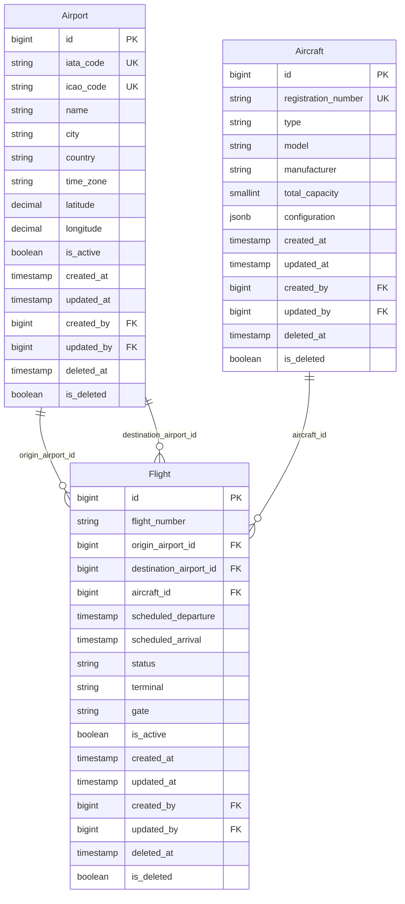

# JPA Relationships

This document describes the JPA relationships between the core domain entities in Falcon Airlines: Airport, Aircraft, and Flight.

## Overview
The Flight entity is the central entity that establishes relationships with both Airport and Aircraft. These relationships are implemented using JPA annotations and are persisted through foreign key constraints in the database.

## Flight → Airport (Origin)

### Entity A
Flight (`com.falcon.airlines.entity.Flight`)

### Entity B
Airport (`com.falcon.airlines.entity.Airport`)

### Cardinality
Many-to-One (Many flights can originate from one airport)

### Owning Side
Flight is the owning side of this relationship.

### Foreign Key
`origin_airport_id` in the `flights` table

### @JoinColumn
```java
@ManyToOne(fetch = FetchType.LAZY)
@JoinColumn(name = "origin_airport_id", nullable = false)
private Airport originAirport;
```

### Fetch Strategy
`FetchType.LAZY` - The origin airport is loaded on-demand when accessed, not when the flight is loaded. This prevents unnecessary database queries when flight data is retrieved without needing airport details.

### Cascade
No cascade operations are defined. Airports are managed independently from flights. Deleting a flight does not affect the airport, and deleting an airport is prevented by referential integrity checks.

### Orphan Removal
Not applicable (orphanRemoval is not set).

### Nullable Constraints
`nullable = false` - The origin airport is required. A flight cannot exist without an origin airport.

### Database Referential Integrity
```sql
origin_airport_id BIGINT NOT NULL REFERENCES airports(id)
```
The database enforces that the `origin_airport_id` must reference a valid airport ID. Attempts to insert a flight with a non-existent airport ID will fail.

---

## Flight → Airport (Destination)

### Entity A
Flight (`com.falcon.airlines.entity.Flight`)

### Entity B
Airport (`com.falcon.airlines.entity.Airport`)

### Cardinality
Many-to-One (Many flights can arrive at one airport)

### Owning Side
Flight is the owning side of this relationship.

### Foreign Key
`destination_airport_id` in the `flights` table

### @JoinColumn
```java
@ManyToOne(fetch = FetchType.LAZY)
@JoinColumn(name = "destination_airport_id", nullable = false)
private Airport destinationAirport;
```

### Fetch Strategy
`FetchType.LAZY` - The destination airport is loaded on-demand when accessed.

### Cascade
No cascade operations are defined. Airports are managed independently from flights.

### Orphan Removal
Not applicable.

### Nullable Constraints
`nullable = false` - The destination airport is required. A flight cannot exist without a destination airport.

### Database Referential Integrity
```sql
destination_airport_id BIGINT NOT NULL REFERENCES airports(id)
```
The database enforces that the `destination_airport_id` must reference a valid airport ID.

---

## Flight → Aircraft

### Entity A
Flight (`com.falcon.airlines.entity.Flight`)

### Entity B
Aircraft (`com.falcon.airlines.entity.Aircraft`)

### Cardinality
Many-to-One (Many flights can use one aircraft over time)

### Owning Side
Flight is the owning side of this relationship.

### Foreign Key
`aircraft_id` in the `flights` table

### @JoinColumn
```java
@ManyToOne(fetch = FetchType.LAZY)
@JoinColumn(name = "aircraft_id", nullable = false)
private Aircraft aircraft;
```

### Fetch Strategy
`FetchType.LAZY` - The aircraft is loaded on-demand when accessed.

### Cascade
No cascade operations are defined. Aircraft are managed independently from flights. Deleting a flight does not affect the aircraft, and deleting an aircraft is prevented by referential integrity checks.

### Orphan Removal
Not applicable.

### Nullable Constraints
`nullable = false` - The aircraft is required. A flight cannot exist without an assigned aircraft.

### Database Referential Integrity
```sql
aircraft_id BIGINT NOT NULL REFERENCES aircraft(id)
```
The database enforces that the `aircraft_id` must reference a valid aircraft ID.

---

## Bidirectional Relationships
None of the relationships are bidirectional. The Airport and Aircraft entities do not have collections of Flight entities. This is a deliberate design choice:

- **Simpler entity model**: No need to manage bidirectional synchronization
- **Query flexibility**: Flight queries can be executed through the FlightRepository with specifications
- **Performance**: Avoids loading large collections when fetching airports or aircraft
- **Business logic alignment**: The system primarily queries flights, not the reverse

If needed, flights can be queried using repository methods:
```java
List<Flight> findByOriginAirportIdAndDestinationAirportId(Long originId, Long destinationId);
List<Flight> findByAircraftIdAndScheduledArrivalGreaterThanAndScheduledDepartureLessThanAndIsActiveTrue(...);
```

---

## Entity Relationship Diagram



---

## Lazy Loading Considerations

### Current Implementation
All `@ManyToOne` relationships use `FetchType.LAZY`. This means:

- When a Flight is loaded, the associated Airport and Aircraft entities are not immediately loaded
- Accessing `flight.getOriginAirport()` triggers a separate SQL query to load the airport
- This is the default behavior for `@ManyToOne` in JPA

### Potential N+1 Query Problem
When loading multiple flights and accessing their relationships, N+1 queries can occur:

```java
// 1 query to load all flights
List<Flight> flights = flightRepository.findAll();

// N additional queries to load origin airports for each flight
flights.forEach(f -> System.out.println(f.getOriginAirport().getName()));
```

### Mitigation Strategies
The current implementation does not include explicit JOIN FETCH queries or EntityGraphs. If performance issues arise, consider:

1. **JOIN FETCH in repository queries**:
```java
@Query("SELECT f FROM Flight f JOIN FETCH f.originAirport JOIN FETCH f.destinationAirport JOIN FETCH f.aircraft WHERE f.id = :id")
Optional<Flight> findByIdWithRelations(@Param("id") Long id);
```

2. **EntityGraph**:
```java
@EntityGraph(attributePaths = {"originAirport", "destinationAirport", "aircraft"})
Optional<Flight> findById(Long id);
```

3. **DTO projections**: Use repository projections to fetch only needed fields without loading full entities

---

## Soft Delete Impact

All three entities extend `AuditEntity` which includes `@SQLRestriction("is_deleted = false")`:

```java
@SQLRestriction("is_deleted = false")
public class Airport extends AuditEntity
```

This annotation automatically adds a WHERE clause to all JPA queries, filtering out soft-deleted records. This affects relationships:

- Queries for flights will only include flights where `is_deleted = false`
- When accessing `flight.getOriginAirport()`, only non-deleted airports are returned
- Referential integrity checks in service layers explicitly check for active references:
```java
if (flightRepository.existsByOriginAirportIdAndIsActiveTrue(id) ||
    flightRepository.existsByDestinationAirportIdAndIsActiveTrue(id)) {
    throw new BaseException("Airport is referenced by active flights", ...);
}
```

---

## Database Indexes Supporting Relationships

The following indexes support the foreign key relationships and common query patterns:

```sql
-- Flight search index
CREATE INDEX idx_flights_search ON flights (origin_airport_id, destination_airport_id, scheduled_departure);

-- Aircraft lookup index
CREATE INDEX idx_flights_aircraft ON flights (aircraft_id);

-- Status filter index
CREATE INDEX idx_flights_status ON flights (status);

-- Active flights partial index
CREATE INDEX idx_flights_active ON flights (is_active) WHERE is_active = TRUE AND is_deleted = FALSE;

-- Airport country/active index
CREATE INDEX idx_airports_country_active ON airports (country, is_active);

-- Aircraft type index
CREATE INDEX idx_aircraft_type ON aircraft (type);
```

These indexes optimize queries that join flights with airports and aircraft, and filter by common search criteria.
