# JWT Authentication Flow

## Purpose

This document describes the end-to-end JWT authentication and authorization
architecture implemented in the Falcon Airlines Enterprise Spring Boot backend.
All component names, packages, and filters match the actual source code.

## Mermaid Flowchart

```mermaid
graph TD
    CLIENT["Client"]

    subgraph "Login Phase"
        AC["com.falcon.airlines.controller.AuthController"]
        AS["com.falcon.airlines.service.AuthService"]
        AM["org.springframework.security.authentication.AuthenticationManager"]
        LR["com.falcon.airlines.dto.request.LoginRequest"]
        DAO["org.springframework.security.authentication.dao.DaoAuthenticationProvider"]
        CUDS["com.falcon.airlines.security.service.CustomUserDetailsService"]
        UP["com.falcon.airlines.security.principal.UserPrincipal"]
        BPE["org.springframework.security.crypto.bcrypt.BCryptPasswordEncoder"]
        JS["com.falcon.airlines.security.jwt.JwtService"]
        JP["com.falcon.airlines.security.jwt.JwtProperties"]
        RT["com.falcon.airlines.entity.RefreshToken"]
        RTR["com.falcon.airlines.repository.RefreshTokenRepository"]
        TR["com.falcon.airlines.dto.response.TokenResponse"]
    end

    subgraph "Authenticated Request Phase"
        REQ["HTTP Request with Authorization: Bearer ..."]
        JAF["com.falcon.airlines.security.jwt.JwtAuthenticationFilter"]
        JTU["com.falcon.airlines.security.jwt.JwtTokenUtil"]
        SCH["org.springframework.security.core.context.SecurityContextHolder"]
        UPA["org.springframework.security.authentication.UsernamePasswordAuthenticationToken"]
        CTRL["com.falcon.airlines.controller.*"]
    end

    CLIENT -->|POST /auth/login username/email + password| AC
    AC -->|delegates| AS
    AS -->|creates UsernamePasswordAuthenticationToken| AM
    AM -->|delegates| DAO
    DAO -->|loadUserByUsername| CUDS
    CUDS -->|findByUsername / findByEmail| UR["com.falcon.airlines.repository.UserRepository"]
    CUDS -->|builds| UP
    DAO -->|matches password| BPE
    DAO -->|returns authenticated UserPrincipal| AM
    AM -->|Authentication with principal| AS
    AS -->|generateAccessToken userPrincipal + claims| JS
    JS -->|secret + accessTokenExpiration| JP
    AS -->|create persisted RefreshToken| RT
    RT -->|save| RTR
    AS -->|wraps access/refresh tokens| TR
    TR -->|ApiResponse<TokenResponse>| AC
    AC -->|200 OK| CLIENT

    CLIENT -->|subsequent request| REQ
    REQ --> JAF
    JAF -->|resolve Authorization Bearer token| JTU
    JAF -->|extractUsername + isTokenValid| JS
    JAF -->|loadUserByUsername username| CUDS
    JAF -->|new UsernamePasswordAuthenticationToken principal/authorities| UPA
    UPA -->|setAuthentication| SCH
    SCH -->|filter continues / reaches controller| CTRL
```

## How it works

### 1. Login

The client calls `POST /auth/login` exposed by
`com.falcon.airlines.controller.AuthController`. The `LoginRequest` payload
can contain either a username or an email.

`AuthController` delegates to `com.falcon.airlines.service.AuthService.login()`,
which builds a `UsernamePasswordAuthenticationToken` and hands it to the
`AuthenticationManager`.

### 2. Username/password authentication

The `AuthenticationManager` uses a `DaoAuthenticationProvider` configured in
`com.falcon.airlines.config.SecurityConfig`. The provider:

- Loads the user via `com.falcon.airlines.security.service.CustomUserDetailsService`
- Resolves active roles and permissions from `UserRoleRepository` and
  `RolePermissionRepository`
- Builds a `com.falcon.airlines.security.principal.UserPrincipal` carrying
  `SimpleGrantedAuthority` entries such as `ROLE_CUSTOMER` and permission codes
- Verifies the password with `org.springframework.security.crypto.bcrypt.BCryptPasswordEncoder`

If the credentials match, an authenticated `Authentication` object is returned.

### 3. JWT access token generation

`AuthService` extracts the `UserPrincipal` from the `Authentication` result and
passes it to `com.falcon.airlines.security.jwt.JwtService`.

`JwtService`:

- Signs tokens with the secret configured in `JwtProperties` (`jwt.secret`)
- Sets the access-token lifetime from `JwtProperties.accessTokenExpiration`
- Includes the `sub` (username), `userId`, and `roles` claims

### 4. Refresh token generation

Alongside the access token, `AuthService` creates a new
`com.falcon.airlines.entity.RefreshToken`, stores it in the database via
`RefreshTokenRepository`, and returns both tokens wrapped in a `TokenResponse`.

### 5. Client receives tokens

The controller returns an `ApiResponse<TokenResponse>` with `accessToken`,
`refreshToken`, `tokenType` (`Bearer`), `expiresIn`, etc.

### 6. Refreshing access tokens

Clients can call `POST /auth/refresh` with a refresh token. `AuthService.refresh()`
validates the persisted `RefreshToken`, marks it as `REVOKED`, creates a new
rotated refresh token, and returns a new access token.

### 7. Subsequent authenticated API requests

For protected endpoints the client sends `Authorization: Bearer <accessToken>`.

`com.falcon.airlines.security.jwt.JwtAuthenticationFilter` runs before
`UsernamePasswordAuthenticationFilter` and:

- Uses `com.falcon.airlines.security.jwt.JwtTokenUtil.resolveToken()` to strip
  the `Bearer ` prefix
- Calls `JwtService.extractUsername()` and `JwtService.isTokenValid()` to
  validate the signature and expiration
- Reloads the user through `CustomUserDetailsService` to get current authorities
- Creates a `UsernamePasswordAuthenticationToken` and places it into
  `org.springframework.security.core.context.SecurityContextHolder`

### 8. Controller access

`SecurityConfig` declares a stateless `SecurityFilterChain`:

- `SessionCreationPolicy.STATELESS`
- Public: `/auth/**`, `/swagger-ui/**`, `/v3/api-docs/**`, `/actuator/health`
- All other requests must be authenticated
- Method-level security is enabled via `@EnableMethodSecurity(prePostEnabled = true)`
  and a `RoleHierarchy` of `ROLE_ADMIN > ROLE_AGENT > ROLE_CUSTOMER`

After the JWT filter populates the security context, the request reaches the
target controller. `@PreAuthorize` expressions can then enforce role- or
permission-based access.
