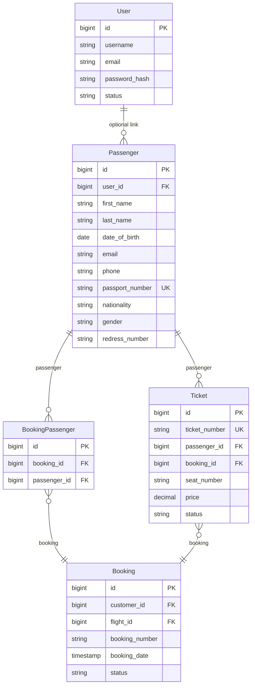

# Passenger Domain

## Purpose
The Passenger domain manages passenger information in the Falcon Airlines system. It provides CRUD operations, search capabilities, and ensures data integrity through validation and uniqueness constraints. Passengers are linked to bookings through tickets and booking-passenger relationships, enabling tracking of passenger travel history.

## Entity
The `Passenger` entity is defined in `com.falcon.airlines.entity.Passenger`. It extends `AuditEntity`, which provides audit fields (created_at, updated_at, created_by, updated_by, deleted_at, is_deleted) inherited from `BaseEntity`.

```java
@Entity
@Table(name = "passengers")
@SQLRestriction("is_deleted = false")
public class Passenger extends AuditEntity
```

The `@SQLRestriction("is_deleted = false")` annotation ensures that soft-deleted records are automatically filtered out from all JPA queries.

## Database Structure
The passengers table is defined in the Flyway migration `V2__create_schema.sql`:

```sql
CREATE TABLE IF NOT EXISTS passengers (
    id BIGSERIAL PRIMARY KEY,
    user_id BIGINT REFERENCES users(id),
    first_name VARCHAR(100) NOT NULL,
    last_name VARCHAR(100) NOT NULL,
    date_of_birth DATE NOT NULL,
    email VARCHAR(255),
    phone VARCHAR(20),
    passport_number VARCHAR(50),
    nationality CHAR(3),
    gender CHAR(1) NOT NULL CHECK (gender IN ('M', 'F', 'O')),
    redress_number VARCHAR(20),
    created_at TIMESTAMPTZ NOT NULL DEFAULT now(),
    updated_at TIMESTAMPTZ NOT NULL DEFAULT now(),
    created_by BIGINT REFERENCES users(id),
    updated_by BIGINT REFERENCES users(id),
    deleted_at TIMESTAMPTZ,
    is_deleted BOOLEAN NOT NULL DEFAULT FALSE
);
```

Indexes supporting passenger queries:
- Unique constraint on `passport_number`
- Foreign key constraint on `user_id` REFERENCES users(id)
- Check constraint on `gender` IN ('M', 'F', 'O')

## Fields

| Field | Type | Database Column | Nullable | Unique | Description |
|-------|------|-----------------|----------|--------|-------------|
| id | Long | id | No | Yes | Primary key (auto-generated) |
| userId | Long | user_id | Yes | No | Optional link to User account |
| firstName | String | first_name | No | No | Passenger's first name |
| lastName | String | last_name | No | No | Passenger's last name |
| dateOfBirth | LocalDate | date_of_birth | No | No | Passenger's date of birth |
| email | String | email | Yes | No | Passenger's email address |
| phone | String | phone | Yes | No | Passenger's phone number |
| passportNumber | String | passport_number | Yes | Yes | Passport number (unique) |
| nationality | String | nationality | Yes | No | 3-letter ISO country code |
| gender | Gender | gender | No | No | Gender (M, F, or O) |
| redressNumber | String | redress_number | Yes | No | TSA redress number |

## Validation Rules
Validation is enforced at the DTO level in `PassengerRequest`:

- **firstName**: `@NotBlank`, `@Size(max = 100)` - Required, maximum 100 characters
- **lastName**: `@NotBlank`, `@Size(max = 100)` - Required, maximum 100 characters
- **dateOfBirth**: `@NotNull`, `@Past` - Required, must be in the past
- **email**: `@Email`, `@Size(max = 255)` - Optional, must be valid email format
- **phone**: `@Pattern(regexp = "^\\+?[0-9\\s\\-()]{7,20}$")`, `@Size(max = 20)` - Optional, must match phone pattern
- **passportNumber**: `@Pattern(regexp = "^[A-Z0-9<]{6,50}$")`, `@Size(max = 50)` - Optional, alphanumeric 6-50 characters
- **nationality**: `@Pattern(regexp = "^[A-Z]{3}$")`, `@Size(max = 3)` - Optional, 3-letter ISO country code
- **gender**: `@NotNull` - Required, must be M, F, or O
- **redressNumber**: `@Size(max = 20)` - Optional, maximum 20 characters

## Uniqueness
Uniqueness is enforced at both database and application levels:

1. **Database level**: UNIQUE constraint on `passport_number`
2. **Application level**: `PassengerService` checks for duplicate passport numbers and emails before create/update operations

The service uses repository methods:
- `findByPassportNumber(String passportNumber)` - for create operations
- `findByPassportNumberAndIdNot(String passportNumber, Long id)` - for update operations (excludes current record)
- `findByEmail(String email)` - for create operations
- `findByEmailAndIdNot(String email, Long id)` - for update operations

If a duplicate is found, a `BaseException` is thrown with error code `DUPLICATE_PASSPORT` or `DUPLICATE_EMAIL` and HTTP status `409 CONFLICT`.

**Note**: Frequent flyer number validation is NOT implemented as the schema does not contain a frequent flyer field.

## CRUD Operations

### Create
- **Endpoint**: `POST /api/passengers`
- **Controller**: `PassengerController.createPassenger()`
- **Service**: `PassengerService.createPassenger()`
- **Authorization**: `@PreAuthorize("hasAnyAuthority('PASSENGER_WRITE')")`
- **Validation**: `@Valid` on `PassengerRequest`
- **Response**: `201 CREATED` with `PassengerResponse`

### Read (by ID)
- **Endpoint**: `GET /api/passengers/{id}`
- **Controller**: `PassengerController.getPassengerById()`
- **Service**: `PassengerService.getPassengerById()`
- **Authorization**: `@PreAuthorize("hasAnyAuthority('PASSENGER_READ')")`
- **Response**: `200 OK` with `PassengerResponse`
- **Error**: `404 NOT_FOUND` if passenger does not exist

### Update
- **Endpoint**: `PUT /api/passengers/{id}`
- **Controller**: `PassengerController.updatePassenger()`
- **Service**: `PassengerService.updatePassenger()`
- **Authorization**: `@PreAuthorize("hasAnyAuthority('PASSENGER_WRITE')")`
- **Validation**: `@Valid` on `PassengerRequest`
- **Response**: `200 OK` with `PassengerResponse`
- **Error**: `404 NOT_FOUND` if passenger does not exist, `409 CONFLICT` for duplicate passport/email

### Delete
- **Endpoint**: `DELETE /api/passengers/{id}`
- **Controller**: `PassengerController.deletePassenger()`
- **Service**: `PassengerService.deletePassenger()`
- **Authorization**: `@PreAuthorize("hasAnyAuthority('PASSENGER_WRITE')")`
- **Implementation**: Soft delete - sets `isDeleted = true`, `deletedAt = now()`
- **Referential Integrity Check**: Prevents deletion if passenger is referenced by tickets or booking-passengers
  - Checks: `ticketRepository.existsByPassengerId(id)` or `bookingPassengerRepository.existsByPassengerId(id)`
  - Error: `409 CONFLICT` with code `PASSENGER_IN_USE` if referenced
- **Response**: `200 OK`

## Search
Passenger search is implemented via `PassengerService.searchPassengers()` using JPA Specifications:

### Search Parameters
- **firstName**: Searches first name (case-insensitive, partial match)
- **lastName**: Searches last name (case-insensitive, partial match)
- **email**: Searches email (case-insensitive, partial match)
- **passportNumber**: Searches passport number (case-insensitive, partial match)
- **userId**: Filters by user ID (exact match)
- **fullName**: Searches both first and last name (case-insensitive, partial match)

### Implementation
The `buildSpecification()` method constructs dynamic queries:

```java
Specification<Passenger> spec = (root, query, cb) -> cb.equal(root.get("isDeleted"), false);

if (firstName != null && !firstName.isBlank()) {
    String like = "%" + firstName.toLowerCase() + "%";
    spec = spec.and((root, query, cb) -> cb.like(cb.lower(root.get("firstName")), like));
}

if (fullName != null && !fullName.isBlank()) {
    String like = "%" + fullName.toLowerCase() + "%";
    spec = spec.and((root, query, cb) -> cb.or(
            cb.like(cb.lower(root.get("firstName")), like),
            cb.like(cb.lower(root.get("lastName")), like)));
}
```

All search filters use case-insensitive LIKE queries with wildcards for partial matching.

## Pagination
Pagination is handled through Spring Data's `Pageable` interface:

- **Endpoint**: `GET /api/passengers` with query parameters `page`, `size`, `sort`
- **Controller**: Accepts `Pageable` parameter
- **Service**: Returns `Page<PassengerResponse>`
- **Repository**: Uses `JpaSpecificationExecutor<Passenger>.findAll(spec, pageable)`

The `PassengerRepository` extends both `JpaRepository` and `JpaSpecificationExecutor` to support pagination with dynamic specifications.

## Passenger History
Passenger history is implemented via `PassengerService.getPassengerHistory()`:

- **Endpoint**: `GET /api/passengers/{id}/history`
- **Controller**: `PassengerController.getPassengerHistory()`
- **Service**: `PassengerService.getPassengerHistory()`
- **Authorization**: `@PreAuthorize("hasAnyAuthority('PASSENGER_READ')")`
- **Implementation**: Counts tickets and booking-passengers associated with the passenger
  - `ticketRepository.findByPassengerId(id).size()` - ticket count
  - `bookingPassengerRepository.findByPassengerId(id).size()` - booking count
- **Response**: `200 OK` with `PassengerResponse` including `ticketCount` and `bookingCount` fields
- **Error**: `404 NOT_FOUND` if passenger does not exist

## Repository Layer
`PassengerRepository` provides the following custom methods:

```java
public interface PassengerRepository extends JpaRepository<Passenger, Long>, JpaSpecificationExecutor<Passenger> {
    Optional<Passenger> findByPassportNumber(String passportNumber);
    Optional<Passenger> findByPassportNumberAndIdNot(String passportNumber, Long id);
    Optional<Passenger> findByEmail(String email);
    Optional<Passenger> findByEmailAndIdNot(String email, Long id);
    boolean existsByUserId(Long userId);
}
```

Additional repositories used for passenger history:
- `TicketRepository.findByPassengerId(Long id)` - returns list of tickets for passenger
- `TicketRepository.existsByPassengerId(Long id)` - checks if passenger has tickets
- `BookingPassengerRepository.findByPassengerId(Long id)` - returns list of booking-passenger links
- `BookingPassengerRepository.existsByPassengerId(Long id)` - checks if passenger is in bookings

## Service Layer
`PassengerService` contains all business logic:

- **createPassenger()**: Validates user existence, validates uniqueness, maps request to entity, saves, returns response
- **getPassengerById()**: Fetches by ID, throws if not found
- **updatePassenger()**: Fetches existing, validates uniqueness, updates fields, saves
- **deletePassenger()**: Checks referential integrity, performs soft delete
- **listPassengers()**: Delegates to search with null filters
- **searchPassengers()**: Builds specification, queries with pagination
- **getPassengerHistory()**: Fetches passenger, counts tickets and bookings, returns enriched response
- **validateUniqueness()**: Checks passport number and email uniqueness
- **buildSpecification()**: Constructs dynamic JPA Specification

## Controller Layer
`PassengerController` exposes REST endpoints:

```java
@RestController
@RequestMapping("/api/passengers")
@Tag(name = "Passenger Management", description = "Passenger CRUD, search and history operations")
public class PassengerController {
    @GetMapping
    @PreAuthorize("hasAnyAuthority('PASSENGER_READ')")
    public ResponseEntity<ApiResponse<Page<PassengerResponse>>> searchPassengers(...)

    @GetMapping("/{id}")
    @PreAuthorize("hasAnyAuthority('PASSENGER_READ')")
    public ResponseEntity<ApiResponse<PassengerResponse>> getPassengerById(@PathVariable Long id)

    @GetMapping("/{id}/history")
    @PreAuthorize("hasAnyAuthority('PASSENGER_READ')")
    public ResponseEntity<ApiResponse<PassengerResponse>> getPassengerHistory(@PathVariable Long id)

    @PostMapping
    @PreAuthorize("hasAnyAuthority('PASSENGER_WRITE')")
    public ResponseEntity<ApiResponse<PassengerResponse>> createPassenger(@Valid @RequestBody PassengerRequest request)

    @PutMapping("/{id}")
    @PreAuthorize("hasAnyAuthority('PASSENGER_WRITE')")
    public ResponseEntity<ApiResponse<PassengerResponse>> updatePassenger(...)

    @DeleteMapping("/{id}")
    @PreAuthorize("hasAnyAuthority('PASSENGER_WRITE')")
    public ResponseEntity<ApiResponse<String>> deletePassenger(@PathVariable Long id)
}
```

All endpoints are protected with JWT authentication (`@SecurityRequirement(name = "bearerAuth")`) and method-level security annotations.

## Exception Handling
The service layer throws `BaseException` for error conditions:

- **Passenger not found**: `404 NOT_FOUND`, code `PASSENGER_NOT_FOUND`
- **Duplicate passport**: `409 CONFLICT`, code `DUPLICATE_PASSPORT`
- **Duplicate email**: `409 CONFLICT`, code `DUPLICATE_EMAIL`
- **User not found**: `404 NOT_FOUND`, code `USER_NOT_FOUND`
- **Passenger in use**: `409 CONFLICT`, code `PASSENGER_IN_USE`

These exceptions are caught by `GlobalExceptionHandler` and converted to standardized `ApiErrorResponse` objects.

## Security

### Authentication
All endpoints require JWT authentication. The `JwtAuthenticationFilter` validates the Bearer token and sets up the Spring Security context.

### Authorization
- **Read operations** (GET): Require `PASSENGER_READ` authority
  - Accessible by users with roles that include `PASSENGER_READ` permission
- **Write operations** (POST, PUT, DELETE): Require `PASSENGER_WRITE` authority
  - Accessible by users with roles that include `PASSENGER_WRITE` permission

### Method-Level Security
`@PreAuthorize` annotations enforce authorization at the method level:
- `@PreAuthorize("hasAnyAuthority('PASSENGER_READ')")` for read operations
- `@PreAuthorize("hasAnyAuthority('PASSENGER_WRITE')")` for write operations

## Relationships with Other Entities

The Passenger entity has relationships with User, Ticket, and BookingPassenger:



Passenger entity defines the relationships:
```java
@ManyToOne(fetch = FetchType.LAZY)
@JoinColumn(name = "user_id")
private User user;
```

Ticket entity defines the relationship to Passenger:
```java
@ManyToOne(fetch = FetchType.LAZY)
@JoinColumn(name = "passenger_id", nullable = false)
private Passenger passenger;
```

BookingPassenger entity defines the relationship to Passenger:
```java
@ManyToOne(fetch = FetchType.LAZY)
@JoinColumn(name = "passenger_id", nullable = false)
private Passenger passenger;
```

The foreign key constraints in the database ensure referential integrity:
- `passengers.user_id REFERENCES users(id)`
- `tickets.passenger_id REFERENCES passengers(id)`
- `booking_passengers.passenger_id REFERENCES passengers(id)`

Soft delete is implemented via the `@SQLRestriction("is_deleted = false")` annotation, which automatically filters out deleted passengers from JPA queries.
