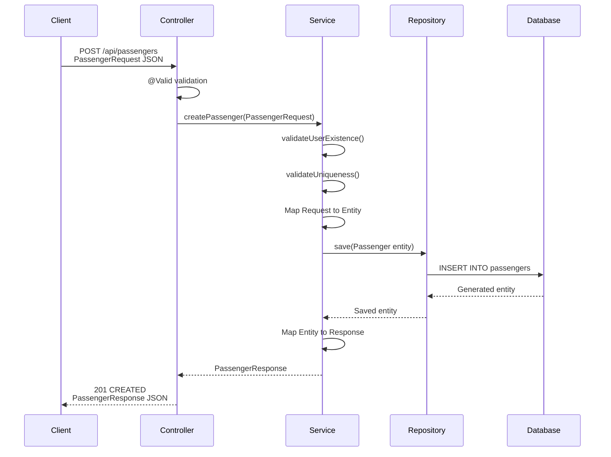
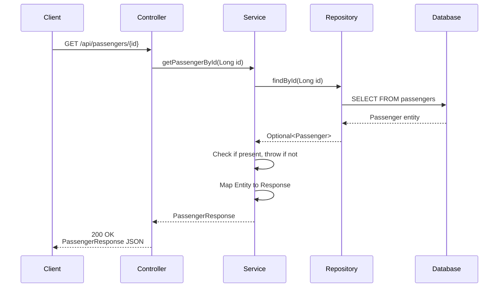
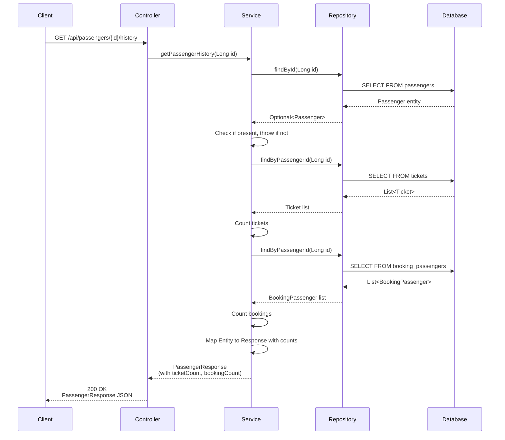

# Passenger DTO Mapping

## Overview
The Falcon Airlines system uses Data Transfer Objects (DTOs) to separate the API layer from the domain layer. This ensures that JPA entities are never directly exposed to clients, providing better control over data serialization, validation, and security.

## DTO Classes

### PassengerRequest
`PassengerRequest` is used for creating and updating passengers.

**Location**: `com.falcon.airlines.dto.request.PassengerRequest`

**Fields**:
```java
private Long userId;
private String firstName;
private String lastName;
private LocalDate dateOfBirth;
private String email;
private String phone;
private String passportNumber;
private String nationality;
private Gender gender;
private String redressNumber;
```

**Annotations**:
- Bean Validation annotations (`@NotBlank`, `@NotNull`, `@Pattern`, `@Size`, `@Email`, `@Past`)
- Lombok `@Getter` and `@Setter` for automatic getter/setter generation

### PassengerResponse
`PassengerResponse` is used for returning passenger data to clients.

**Location**: `com.falcon.airlines.dto.response.PassengerResponse`

**Fields**:
```java
private Long id;
private Long userId;
private String firstName;
private String lastName;
private LocalDate dateOfBirth;
private String email;
private String phone;
private String passportNumber;
private String nationality;
private Gender gender;
private String redressNumber;
private Integer ticketCount;
private Integer bookingCount;
private Instant createdAt;
private Instant updatedAt;
```

**Additional Fields**:
- `ticketCount`: Number of tickets associated with the passenger (for history endpoint)
- `bookingCount`: Number of bookings associated with the passenger (for history endpoint)
- `createdAt`: Audit timestamp
- `updatedAt`: Audit timestamp

**Annotations**:
- Lombok `@Getter` and `@Setter` for automatic getter/setter generation

## Mapping Flow

### Create/Update Flow (Request → Entity)



### Read Flow (Entity → Response)



### History Flow (Entity → Response with Counts)



## Mapping Implementation

### Request to Entity Mapping
In `PassengerService`, the mapping from `PassengerRequest` to `Passenger` entity is done using MapStruct's `PassengerMapper`:

```java
Passenger passenger = passengerMapper.toEntity(request);
```

The `PassengerMapper` interface (if using MapStruct) would be defined as:
```java
@Mapper(componentModel = "spring")
public interface PassengerMapper {
    Passenger toEntity(PassengerRequest request);
    PassengerResponse toResponse(Passenger entity);
}
```

If MapStruct is not used, manual mapping would be:
```java
Passenger passenger = new Passenger();
passenger.setUserId(request.getUserId());
passenger.setFirstName(request.getFirstName());
passenger.setLastName(request.getLastName());
passenger.setDateOfBirth(request.getDateOfBirth());
passenger.setEmail(request.getEmail());
passenger.setPhone(request.getPhone());
passenger.setPassportNumber(request.getPassportNumber());
passenger.setNationality(request.getNationality());
passenger.setGender(request.getGender());
passenger.setRedressNumber(request.getRedressNumber());
```

### Entity to Response Mapping
In `PassengerService`, the mapping from `Passenger` entity to `PassengerResponse` is done using MapStruct's `PassengerMapper`:

```java
PassengerResponse response = passengerMapper.toResponse(passenger);
```

For the history endpoint, additional fields are populated:
```java
PassengerResponse response = passengerMapper.toResponse(passenger);
response.setTicketCount(ticketRepository.findByPassengerId(id).size());
response.setBookingCount(bookingPassengerRepository.findByPassengerId(id).size());
```

## Why Entities Are Not Exposed Directly

### Security
- **Prevents Over-posting**: Clients cannot modify fields they shouldn't access (e.g., audit fields, internal IDs)
- **Prevents Information Leakage**: Sensitive fields (e.g., internal IDs, audit trails) are not exposed
- **Controlled Serialization**: Only approved fields are included in API responses

### Separation of Concerns
- **API Layer Independence**: DTOs can evolve independently of entity structure
- **Validation Isolation**: Validation rules are applied at the DTO level, not entity level
- **Contract Stability**: API contracts remain stable even if entity structure changes

### Performance
- **Selective Loading**: DTOs can include only the fields needed for a specific operation
- **Lazy Loading Control**: Prevents accidental N+1 queries by not exposing entity relationships
- **Payload Optimization**: Reduces payload size by excluding unnecessary fields

### Flexibility
- **Multiple Representations**: Different DTOs can represent the same entity in different contexts
- **Data Transformation**: Enables data transformation between API and domain layers
- **Versioning**: Allows API versioning without changing entity structure

## Field Mapping

### PassengerRequest → Passenger Entity

| PassengerRequest Field | Passenger Entity Field | Notes |
|------------------------|------------------------|-------|
| userId | userId | Optional link to User |
| firstName | firstName | Required |
| lastName | lastName | Required |
| dateOfBirth | dateOfBirth | Required, must be past |
| email | email | Optional, validated format |
| phone | phone | Optional, validated pattern |
| passportNumber | passportNumber | Optional, validated pattern, unique |
| nationality | nationality | Optional, 3-letter ISO code |
| gender | gender | Required, enum (M, F, O) |
| redressNumber | redressNumber | Optional |

### Passenger Entity → PassengerResponse

| Passenger Entity Field | PassengerResponse Field | Notes |
|------------------------|-------------------------|-------|
| id | id | Primary key |
| userId | userId | Optional link to User |
| firstName | firstName | |
| lastName | lastName | |
| dateOfBirth | dateOfBirth | |
| email | email | |
| phone | phone | |
| passportNumber | passportNumber | |
| nationality | nationality | |
| gender | gender | |
| redressNumber | redressNumber | |
| - | ticketCount | Computed from Ticket repository |
| - | bookingCount | Computed from BookingPassenger repository |
| createdAt | createdAt | Audit field |
| updatedAt | updatedAt | Audit field |

## JSON Serialization

### Request JSON Example
```json
{
  "userId": 1,
  "firstName": "John",
  "lastName": "Doe",
  "dateOfBirth": "1990-01-01",
  "email": "john.doe@example.com",
  "phone": "+1234567890",
  "passportNumber": "AB1234567",
  "nationality": "USA",
  "gender": "M",
  "redressNumber": null
}
```

### Response JSON Example
```json
{
  "id": 1,
  "userId": 1,
  "firstName": "John",
  "lastName": "Doe",
  "dateOfBirth": "1990-01-01",
  "email": "john.doe@example.com",
  "phone": "+1234567890",
  "passportNumber": "AB1234567",
  "nationality": "USA",
  "gender": "M",
  "redressNumber": null,
  "ticketCount": 5,
  "bookingCount": 3,
  "createdAt": "2026-08-10T10:00:00Z",
  "updatedAt": "2026-08-10T10:00:00Z"
}
```

## Mapping in Controller Layer

The controller layer does not perform mapping directly. It delegates to the service layer:

```java
@RestController
@RequestMapping("/api/passengers")
public class PassengerController {
    
    @PostMapping
    public ResponseEntity<ApiResponse<PassengerResponse>> createPassenger(
            @Valid @RequestBody PassengerRequest request) {
        PassengerResponse response = passengerService.createPassenger(request);
        return ResponseEntity.status(HttpStatus.CREATED)
                .body(ApiResponse.ok("Passenger created successfully", response));
    }
    
    @GetMapping("/{id}")
    public ResponseEntity<ApiResponse<PassengerResponse>> getPassengerById(
            @PathVariable Long id) {
        PassengerResponse response = passengerService.getPassengerById(id);
        return ResponseEntity.ok(ApiResponse.ok("Passenger retrieved successfully", response));
    }
}
```

## Mapping in Service Layer

The service layer handles all mapping logic:

```java
@Service
public class PassengerService {
    
    public PassengerResponse createPassenger(PassengerRequest request) {
        validateUserExistence(request.getUserId());
        validateUniqueness(request, null);
        
        Passenger passenger = passengerMapper.toEntity(request);
        Passenger saved = passengerRepository.save(passenger);
        return passengerMapper.toResponse(saved);
    }
    
    public PassengerResponse getPassengerById(Long id) {
        Passenger passenger = getPassengerOrThrow(id);
        return passengerMapper.toResponse(passenger);
    }
    
    public PassengerResponse getPassengerHistory(Long id) {
        Passenger passenger = getPassengerOrThrow(id);
        PassengerResponse response = passengerMapper.toResponse(passenger);
        response.setTicketCount(ticketRepository.findByPassengerId(id).size());
        response.setBookingCount(bookingPassengerRepository.findByPassengerId(id).size());
        return response;
    }
}
```

## Benefits of DTO Mapping

1. **Security**: Prevents exposing internal entity structure and sensitive fields
2. **Validation**: Enables validation at the DTO level before entity persistence
3. **Flexibility**: Allows different representations for different use cases
4. **Performance**: Enables selective field loading and optimized payloads
5. **Maintainability**: Separates API contract from domain model
6. **Testability**: DTOs can be tested independently of entities
7. **Versioning**: Allows API evolution without breaking entity structure

## Testing

DTO mapping is tested at multiple levels:

1. **DTO Validation Tests** (`PassengerRequestValidationTest`): Tests validation annotations
2. **Service Unit Tests** (`PassengerServiceTest`): Tests mapping logic with mocked mapper
3. **Controller Integration Tests** (`PassengerControllerIntegrationTest`): Tests end-to-end JSON serialization/deserialization
