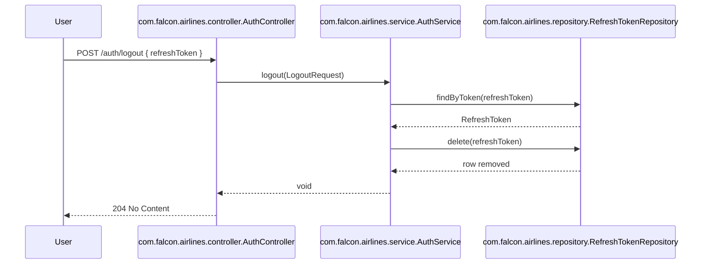

# Refresh Token Lifecycle

## Purpose

This document describes the refresh-token implementation in the Falcon Airlines
Enterprise backend. All behavior comes from the actual source code; features that
exist in a repository/query but are not exercised by the service layer are
marked **TODO**.

## Token lifecycle diagram

```mermaid
graph TD
    subgraph "Login"
        U1["User"]
        AC1["AuthController<br/>POST /auth/login"]
        AS1["AuthService.login(LoginRequest)"]
        AM["AuthenticationManager"]
        JS1["JwtService.generateAccessToken(UserPrincipal)"]
        JP["JwtProperties"]
        RTR1["RefreshTokenRepository.save(RefreshToken)"]
        TR1["TokenResponse"]

        U1 -->|POST /auth/login| AC1
        AC1 --> AS1
        AS1 --> AM
        AM --> AS1
        AS1 --> JS1
        JS1 --> JP
        JS1 -->|accessToken| AS1
        AS1 -->|UUID, ACTIVE, expiresAt| RTR1
        RTR1 --> AS1
        AS1 -->|TokenResponse<br/>{accessToken, refreshToken}| TR1
        TR1 --> AC1
        AC1 -->|200 OK| U1
    end

    subgraph "Using the access token"
        U2["User"]
        JAF["JwtAuthenticationFilter"]
        U2 -->|Authorization: Bearer accessToken| JAF
        JAF --> U2
    end

    subgraph "Access token expired"
        U3["User"]
        AC2["AuthController<br/>POST /auth/refresh"]
        AS2["AuthService.refresh(RefreshTokenRequest)"]
        RTR2["RefreshTokenRepository.findByToken(String)"]
        PG1[(PostgreSQL)]
        JS2["JwtService.generateAccessToken(UserPrincipal)"]
        RTR3["RefreshTokenRepository.save(RefreshToken)"]
        TR2["TokenResponse"]

        U3 -->|POST /auth/refresh oldRefreshToken| AC2
        AC2 --> AS2
        AS2 --> RTR2
        RTR2 --> PG1
        PG1 --> RTR2
        RTR2 --> AS2
        AS2 -->|check status == ACTIVE<br/>check expiresAt > now<br/>check user status == ACTIVE| AS2
        AS2 -->|set status = REVOKED<br/>set revokedAt, lastUsedAt| RTR3
        AS2 --> JS2
        JS2 -->|accessToken| AS2
        AS2 -->|new UUID, ACTIVE, new expiresAt| RTR3
        RTR3 --> AS2
        AS2 -->|TokenResponse<br/>{accessToken, refreshToken}| TR2
        TR2 --> AC2
        AC2 -->|200 OK| U3
    end

    subgraph "Logout"
        U4["User"]
        AC3["AuthController<br/>POST /auth/logout"]
        AS3["AuthService.logout(LogoutRequest)"]
        RTR4["RefreshTokenRepository.findByToken(String)"]
        RTR5["RefreshTokenRepository.delete(RefreshToken)"]

        U4 -->|POST /auth/logout refreshToken| AC3
        AC3 --> AS3
        AS3 --> RTR4
        RTR4 --> RTR5
        RTR5 --> AS3
        AS3 --> AC3
        AC3 -->|204 No Content| U4
    end

    subgraph "Subsequent refresh after logout"
        U5["User"]
        AC4["AuthController<br/>POST /auth/refresh"]
        AS4["AuthService.refresh(RefreshTokenRequest)"]
        RTR6["RefreshTokenRepository.findByToken(String)"]

        U5 -->|POST /auth/refresh revoked/deleted token| AC4
        AC4 --> AS4
        AS4 --> RTR6
        RTR6 -->|Optional.empty()| AS4
        AS4 -->|BaseException<br/>INVALID_REFRESH_TOKEN| AC4
        AC4 -->|401 UNAUTHORIZED| U5
    end
```

## Logout / revocation flow



## Why access tokens are short-lived

Access tokens are configured to expire after 900 seconds (15 minutes) in
`JwtProperties` (`jwt.accessTokenExpiration`). A short lifetime limits the
damage from a leaked token: an attacker has a small time window to use it before
it becomes invalid. Because the backend validates tokens statelessly using the
JWT signature and `exp` claim, it does not need to check a database on every
request.

## Why refresh tokens exist

Refresh tokens let a client obtain a new access token without resending the
user's username and password. They are long-lived (default 604 800 seconds, or
7 days) and are stored in the database so the server can revoke them if needed.
This separation keeps access tokens stateless and short-lived while still
providing a smooth user experience.

## Where refresh tokens are stored

Refresh tokens are persisted in the `refresh_tokens` table in PostgreSQL via
`com.falcon.airlines.entity.RefreshToken` and
`com.falcon.airlines.repository.RefreshTokenRepository`.

Stored fields include:

- `token` — the UUID token string (unique)
- `user_id` — the owner
- `status` — `ACTIVE`, `REVOKED`, or `EXPIRED`
- `expires_at` — the token's expiration timestamp
- `last_used_at` — when the token was last used to refresh
- `revoked_at` — when the token was revoked
- `ip_address`, `device_info`, `user_agent` — client metadata

## How revocation works

Two revocation paths exist in the actual service implementation:

1. **Refresh rotation** — `AuthService.refresh(RefreshTokenRequest)` sets the
   consumed token's `status` to `TokenStatus.REVOKED` and records `revokedAt`
   and `lastUsedAt` before issuing a new token.
2. **Logout** — `AuthService.logout(LogoutRequest)` finds the refresh token and
   calls `RefreshTokenRepository.delete(RefreshToken)`, hard-deleting the row.

The `RefreshTokenRepository` also defines `revokeActiveTokensForUser(User, TokenStatus, Instant)`,
but this method is **not currently called** from the service layer.

## How expiration works

- `AuthService.login(...)` sets `RefreshToken.expiresAt = Instant.now() + JwtProperties.refreshTokenExpiration()`.
- `AuthService.refresh(...)` rejects a token when `expiresAt` is before
  `Instant.now()` and throws a `BaseException` with `INVALID_REFRESH_TOKEN`.
- The `RefreshTokenRepository` has `markExpiredTokens(Instant)` to flip the
  status of `ACTIVE` tokens past their expiry to `EXPIRED`, and
  `deleteByExpiresAtBefore(Instant)` to clean them up. These are **not scheduled
  or invoked** in the current service code. TODO.
- The `EXPIRED` enum value is therefore defined but is not produced by the
  application logic at this time. TODO.

## Is token rotation implemented?

Yes. `AuthService.refresh(...)` implements refresh-token rotation:

1. The old token is marked `REVOKED`.
2. A brand-new `ACTIVE` refresh token is generated.
3. A new access token is generated.
4. The client receives both the new access token and the new refresh token.
5. Any later attempt to reuse the old token is rejected with
   `INVALID_REFRESH_TOKEN` (`401 UNAUTHORIZED`).

## Implemented status summary

| Feature | Status | Notes |
|---------|--------|-------|
| Refresh token persistence | Implemented | `RefreshToken` entity + `RefreshTokenRepository` |
| Token expiration validation | Implemented | `expiresAt` check in `AuthService.refresh` |
| Refresh-token rotation | Implemented | old `REVOKED`, new one issued |
| Hard delete on logout | Implemented | `AuthService.logout` calls `RefreshTokenRepository.delete` |
| Manual revocation during refresh | Implemented | `status = REVOKED` + `revokedAt` |
| `TokenStatus.EXPIRED` usage | TODO | defined, but not set by application logic |
| Scheduled expiration marking | TODO | `markExpiredTokens` exists but is not scheduled/used |
| Scheduled cleanup of expired tokens | TODO | `deleteByExpiresAtBefore` exists but is not scheduled/used |
