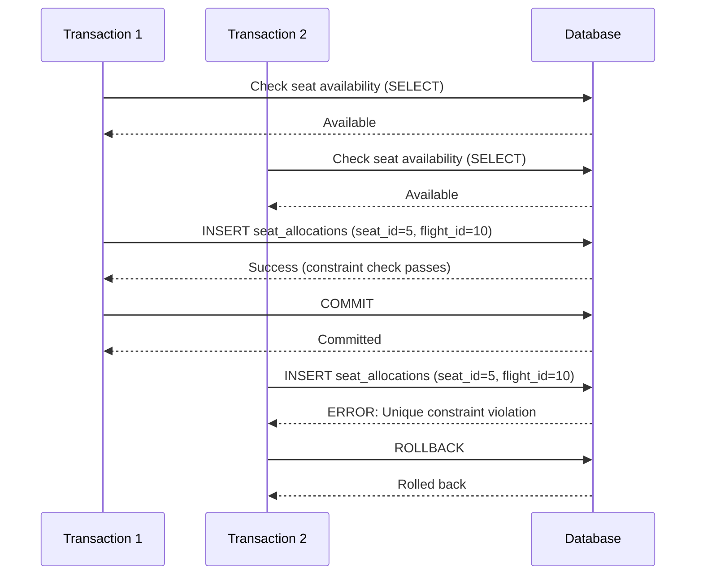
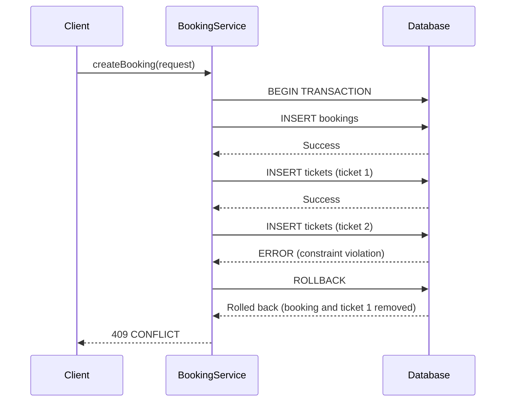
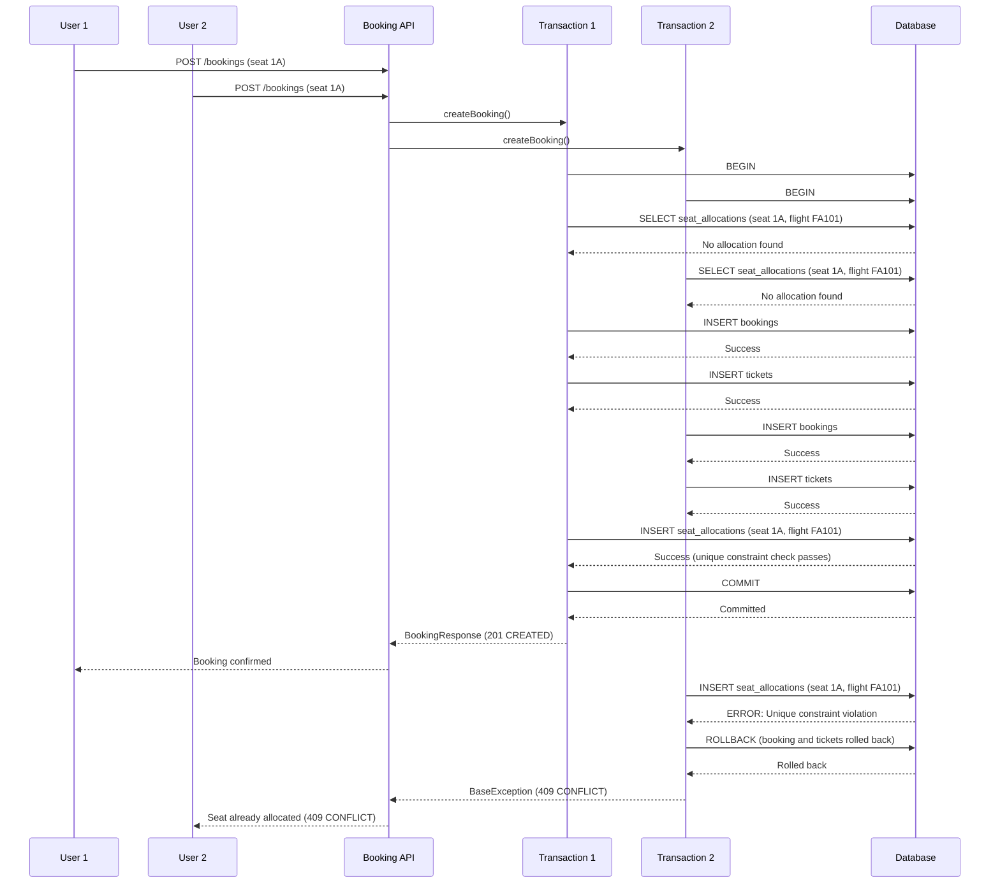
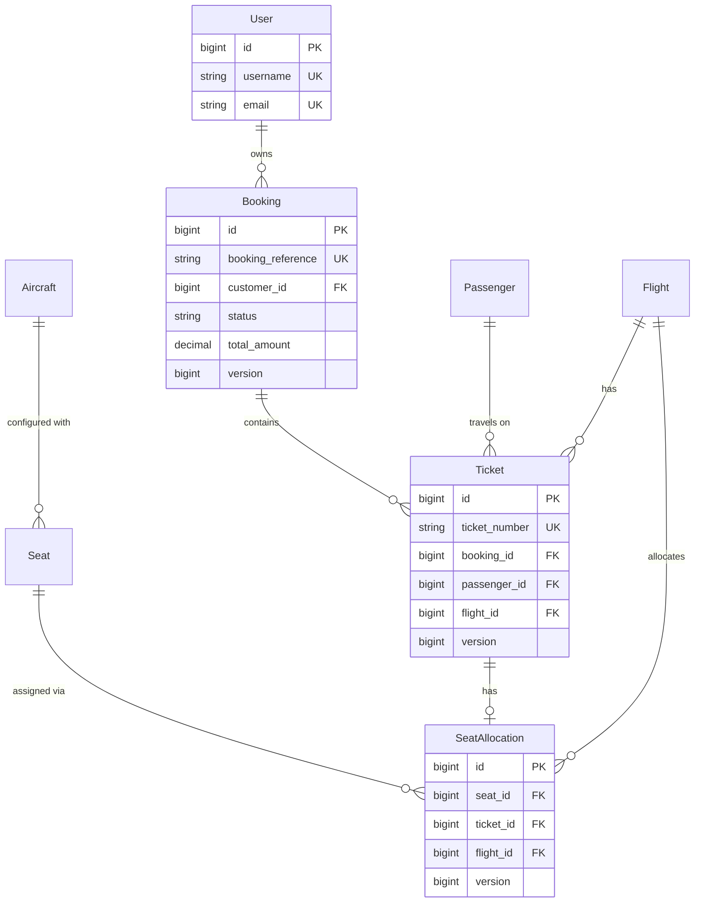
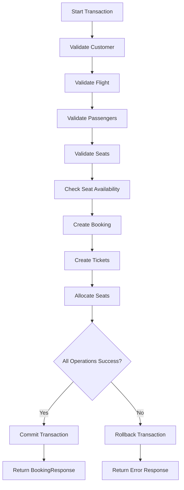
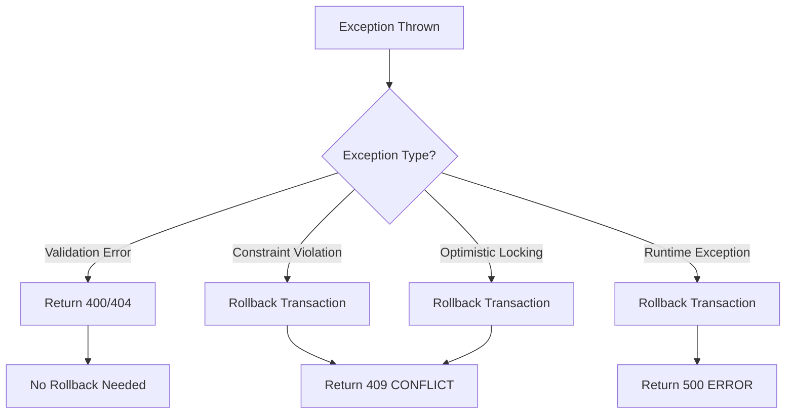
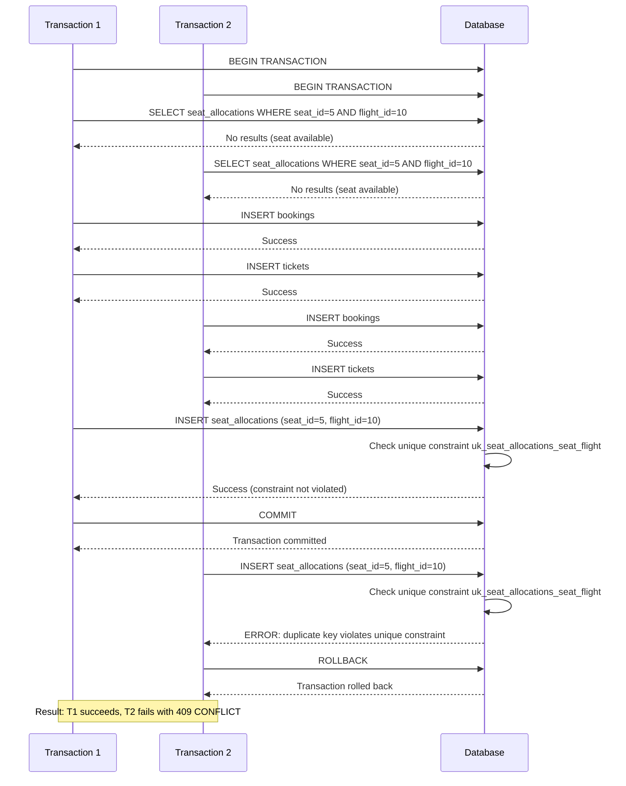

# Booking Engine - Interview Questions

## Overview

This document provides comprehensive interview questions and answers about the Falcon Airlines booking engine implementation. It covers domain concepts, transaction management, locking strategies, and workflow design.

## Core Concepts

### How does booking prevent overbooking?

The booking engine prevents overbooking through a multi-layer defense strategy:

1. **Application-Level Validation**
   - Before creating a booking, the system checks if seats are available using `validateSeatsAvailable()`
   - This provides early feedback and reduces database load

2. **Database Unique Constraint** (Primary Defense)
   - The `seat_allocations` table has a unique index on `(seat_id, flight_id)`
   - This constraint is enforced at the database level and guarantees that a seat cannot be allocated twice on the same flight
   - Even if two transactions pass the application check simultaneously, the database constraint will reject the second allocation

3. **Transaction Atomicity**
   - All booking operations (booking creation, ticket issuance, seat allocation) occur in a single transaction
   - If seat allocation fails due to the constraint violation, the entire transaction rolls back automatically
   - This ensures no partial bookings exist

4. **Exception Handling**
   - Constraint violations are caught and converted to `BaseException` with HTTP 409 CONFLICT status
   - Clients receive clear error messages indicating the seat is already allocated



### How does seat locking work?

The booking engine uses **optimistic locking** combined with **database unique constraints** rather than traditional pessimistic locking:

**Optimistic Locking:**
- Entities (`Booking`, `Ticket`, `SeatAllocation`) have a `@Version` field
- When an entity is loaded, its version is recorded
- When saving, Hibernate checks if the version has changed
- If the version changed, `ObjectOptimisticLockingFailureException` is thrown
- The transaction rolls back automatically

**Database Unique Constraint:**
- The unique constraint on `(seat_id, flight_id)` acts as the final lock
- It prevents duplicate seat allocations at the database level
- This is the primary mechanism that prevents double booking

**Why Optimistic Locking?**
- Better performance under low to moderate contention
- No lock contention during read operations
- Simpler implementation
- Works well with web applications where conflicts are rare

**Why Not Pessimistic Locking?**
- Would require `SELECT FOR UPDATE` queries
- Locks would be held for the duration of the transaction
- Could cause cascading delays under high load
- More complex to implement and debug

### Why use @Transactional?

The `@Transactional` annotation is used on the `BookingService` class for several critical reasons:

1. **Atomicity**
   - Booking creation involves multiple database operations: insert booking, insert tickets, insert seat allocations
   - All these operations must succeed or fail together
   - Without transactions, you could have bookings without tickets, or tickets without seat allocations

2. **Consistency**
   - Ensures the database remains in a consistent state
   - Foreign key constraints are validated within the transaction
   - Business rules are enforced (e.g., seat availability)

3. **Isolation**
   - Each booking operation is isolated from others
   - Intermediate states are not visible to other transactions
   - Prevents dirty reads

4. **Automatic Rollback**
   - If any exception occurs during the transaction, it automatically rolls back
   - No manual rollback logic is needed
   - Ensures no partial data is committed

5. **Simplified Code**
   - Developers don't need to manually begin/commit/rollback transactions
   - Spring handles transaction lifecycle automatically
   - Reduces boilerplate and potential errors

```java
@Service
@Transactional
public class BookingService {
    // All public methods run in a transaction
    // If any exception is thrown, the transaction rolls back
}
```

### What happens if ticket creation fails?

If ticket creation fails during the booking process:

1. **Exception is Thrown**
   - The failure could be due to validation errors, constraint violations, or database errors
   - A `BaseException` or runtime exception is thrown

2. **Transaction Rolls Back**
   - Since the entire operation is in a single `@Transactional` method
   - Spring automatically rolls back the transaction
   - The booking that was already created is rolled back
   - Any tickets that were already created are rolled back

3. **No Partial State**
   - The database remains consistent
   - No orphaned bookings exist
   - No orphaned tickets exist

4. **Client Receives Error**
   - The client receives an appropriate HTTP error response
   - The error message indicates what went wrong
   - The client can retry with corrected data



### What is ACID?

ACID is a set of properties that guarantee database transactions are processed reliably:

**Atomicity**
- All operations in a transaction succeed or fail together
- No partial commits
- In the booking engine: booking, tickets, and seat allocations are created atomically

**Consistency**
- Database transitions from one valid state to another
- All constraints are satisfied
- In the booking engine: foreign keys, unique constraints, and business rules are enforced

**Isolation**
- Concurrent transactions don't interfere with each other
- Intermediate states are not visible
- In the booking engine: each booking operation is isolated from others

**Durability**
- Once a transaction is committed, it remains committed even in case of system failure
- Changes are written to durable storage
- In the booking engine: committed bookings persist even if the application crashes

### What is optimistic locking?

Optimistic locking is a concurrency control strategy that assumes conflicts are rare:

**How It Works:**
1. Each entity has a version number (using `@Version` annotation)
2. When an entity is loaded, its version is recorded
3. When the entity is saved, the version is checked
4. If the version hasn't changed, the save proceeds and version is incremented
5. If the version has changed, an exception is thrown

**In the Booking Engine:**
```java
@Entity
public class Booking extends AuditEntity {
    @Version
    @Column(name = "version", nullable = false)
    private Long version;
}
```

**Advantages:**
- No database locks held during reads
- Better performance under low contention
- Simpler to implement
- Works well with web applications

**Disadvantages:**
- Requires retry logic on conflicts
- Can fail after work is done
- Not ideal for high-contention scenarios

**When Used:**
- Booking updates (status changes)
- Ticket modifications
- Seat allocation updates

### What is pessimistic locking?

Pessimistic locking is a concurrency control strategy that assumes conflicts are likely:

**How It Works:**
1. A transaction acquires a lock on a record when reading it
2. Other transactions must wait for the lock to be released
3. The lock is held until the transaction completes
4. This prevents concurrent modifications

**Implementation (Not Used in Booking Engine):**
```java
@Lock(LockModeType.PESSIMISTIC-write)
Optional<Seat> findBySeatNumber(String seatNumber);
```

**Advantages:**
- Guarantees success if lock is acquired
- No retry logic needed
- Predictable behavior

**Disadvantages:**
- Lock contention reduces performance
- Deadlock potential
- More complex to implement
- Can cause cascading delays

**Why Not Used in Booking Engine:**
- Booking engine has moderate contention
- Optimistic locking provides sufficient guarantees
- Database unique constraints provide final integrity
- Simpler implementation and better performance

### How would two users booking the same seat behave?

When two users attempt to book the same seat simultaneously:



**Outcome:**
- Exactly one booking succeeds (User 1)
- One booking fails with 409 CONFLICT (User 2)
- The failed booking's transaction is rolled back
- No partial data exists in the database
- User 2 can try booking a different seat

**Key Points:**
- Both transactions pass the application-level availability check
- The database unique constraint is the final arbiter
- The transaction that commits first wins
- The second transaction rolls back automatically
- No manual intervention is required

### Why are entities not returned directly?

Entities are not returned directly from service methods for several reasons:

1. **Encapsulation**
   - Entities contain internal implementation details
   - DTOs (Data Transfer Objects) expose only the necessary data
   - Changes to entity structure don't affect API contracts

2. **Lazy Loading Issues**
   - Entities use lazy loading for relationships
   - Accessing lazy-loaded associations outside a transaction causes `LazyInitializationException`
   - DTOs are fully populated before returning

3. **Security**
   - Entities may contain sensitive fields (passwords, internal IDs)
   - DTOs can filter out sensitive information
   - Prevents over-exposure of internal data

4. **Performance**
   - DTOs can be shaped to include only needed data
   - Prevents N+1 query problems
   - Allows selective field inclusion

5. **Separation of Concerns**
   - Entities are for persistence
   - DTOs are for API communication
   - Clear separation between layers

**Example:**
```java
// Entity (not returned directly)
@Entity
public class Booking {
    private Long id;
    private User customer;  // Lazy-loaded
    private List<Ticket> tickets;  // Lazy-loaded
    private Long version;  // Internal field
}

// DTO (returned to client)
public class BookingResponse {
    private Long id;
    private Long customerId;
    private String customerUsername;  // Resolved from customer
    private List<TicketSummaryResponse> tickets;  // Fully populated
    private Integer version;  // Exposed if needed
}
```

### Why is Lazy Loading used?

Lazy loading is used for `@ManyToOne` relationships in the booking engine:

**Benefits:**
1. **Performance**
   - Related entities are loaded only when needed
   - Reduces initial query complexity
   - Avoids loading unnecessary data

2. **Memory Efficiency**
   - Only required data is loaded into memory
   - Reduces memory footprint
   - Improves scalability

3. **Flexibility**
   - Different use cases can load different related data
   - Queries can be optimized per use case
   - Avoids one-size-fits-all queries

**Implementation:**
```java
@ManyToOne(fetch = FetchType.LAZY)
@JoinColumn(name = "customer_id", nullable = false)
private User customer;
```

**Challenges:**
1. **LazyInitializationException**
   - Accessing lazy-loaded associations outside a transaction causes exceptions
   - Requires careful transaction management
   - Solution: Use repository lookups or eager fetching when needed

2. **N+1 Query Problem**
   - Accessing lazy-loaded associations in loops can cause many queries
   - Solution: Use JOIN FETCH queries or batch fetching

**In the Booking Engine:**
- All `@ManyToOne` relationships use lazy loading
- Service methods are transactional to allow lazy loading
- DTOs are populated within the transaction to avoid lazy initialization issues

### What is the transaction isolation concern?

The transaction isolation concern in the booking engine relates to how concurrent transactions interact:

**Key Concerns:**

1. **Thread-Bound Transactions**
   - Spring transactions are thread-bound
   - They are NOT automatically propagated into `CompletableFuture` or `runAsync` threads
   - Each thread needs its own transaction

2. **Integration Test Isolation**
   - Tests with class-level `@Transactional` share a single transaction
   - HTTP requests in tests should execute in separate transactions
   - Concurrent booking tests need separate transactions for each thread

3. **Read Committed Isolation**
   - The booking engine uses the default isolation level (READ_COMMITTED)
   - Uncommitted changes from other transactions are not visible
   - Committed changes from other transactions are visible

4. **Race Conditions**
   - Application-level checks are not atomic with database operations
   - Two transactions can pass the availability check simultaneously
   - Database constraints provide the final guarantee

**Solution for Tests:**
```java
// Remove class-level @Transactional from integration tests
class BookingConcurrencyIntegrationTest extends BaseIntegrationTest {
    // Each HTTP request or concurrent task runs in its own transaction
}
```

**Solution for Concurrency:**
- Use database unique constraints as the final arbiter
- Handle constraint violations gracefully
- Provide clear error messages to clients

## Entity Relationships

### Booking Entity Relationships



## Transaction Flow

### Booking Creation Transaction Flow



### Rollback Flow



## Concurrent Seat Booking

### Concurrent Booking Scenario



## Database Schema

### Key Tables

**bookings**
```sql
CREATE TABLE bookings (
    id BIGSERIAL PRIMARY KEY,
    booking_reference VARCHAR(10) NOT NULL UNIQUE,
    customer_id BIGINT NOT NULL REFERENCES users(id),
    status VARCHAR(20) NOT NULL,
    total_amount DECIMAL(15,2) NOT NULL,
    currency CHAR(3) NOT NULL,
    booking_date TIMESTAMPTZ NOT NULL,
    payment_status VARCHAR(20) NOT NULL,
    version BIGINT NOT NULL DEFAULT 0,
    -- audit fields
    is_deleted BOOLEAN NOT NULL DEFAULT FALSE
);
```

**tickets**
```sql
CREATE TABLE tickets (
    id BIGSERIAL PRIMARY KEY,
    ticket_number VARCHAR(20) NOT NULL UNIQUE,
    booking_id BIGINT NOT NULL REFERENCES bookings(id),
    passenger_id BIGINT NOT NULL REFERENCES passengers(id),
    flight_id BIGINT NOT NULL REFERENCES flights(id),
    fare_basis VARCHAR(10) NOT NULL,
    fare DECIMAL(15,2) NOT NULL,
    taxes DECIMAL(15,2) NOT NULL,
    status VARCHAR(20) NOT NULL,
    issued_at TIMESTAMPTZ NOT NULL,
    version BIGINT NOT NULL DEFAULT 0,
    -- audit fields
    is_deleted BOOLEAN NOT NULL DEFAULT FALSE
);
```

**seat_allocations**
```sql
CREATE TABLE seat_allocations (
    id BIGSERIAL PRIMARY KEY,
    seat_id BIGINT NOT NULL REFERENCES seats(id),
    ticket_id BIGINT NOT NULL REFERENCES tickets(id),
    flight_id BIGINT NOT NULL REFERENCES flights(id),
    allocated_at TIMESTAMPTZ NOT NULL,
    version BIGINT NOT NULL DEFAULT 0,
    -- audit fields
    is_deleted BOOLEAN NOT NULL DEFAULT FALSE,
    
    CONSTRAINT uk_seat_allocations_seat_flight UNIQUE (seat_id, flight_id) WHERE is_deleted = FALSE,
    CONSTRAINT uk_seat_allocations_ticket UNIQUE (ticket_id) WHERE is_deleted = FALSE
);
```

**seats**
```sql
CREATE TABLE seats (
    id BIGSERIAL PRIMARY KEY,
    aircraft_id BIGINT NOT NULL REFERENCES aircraft(id),
    seat_number VARCHAR(10) NOT NULL,
    seat_class VARCHAR(20) NOT NULL CHECK (seat_class IN ('ECONOMY', 'BUSINESS', 'FIRST')),
    row_number SMALLINT,
    column_letter CHAR(1),
    is_active BOOLEAN NOT NULL DEFAULT TRUE,
    -- audit fields
    is_deleted BOOLEAN NOT NULL DEFAULT FALSE,
    
    CONSTRAINT uk_seats_aircraft_seat UNIQUE (aircraft_id, seat_number) WHERE is_deleted = FALSE
);
```

## Performance Considerations

### Indexes

The booking engine uses several indexes to optimize queries:

1. **idx_bookings_customer** - Fast lookup of bookings by customer
2. **idx_bookings_status_payment** - Filter bookings by status and payment status
3. **idx_tickets_booking** - Fast lookup of tickets by booking
4. **idx_tickets_flight** - Fast lookup of tickets by flight
5. **idx_seat_allocations_seat** - Fast lookup of allocations by seat
6. **idx_seat_allocations_flight** - Fast lookup of allocations by flight
7. **uk_seat_allocations_seat_flight** - Unique constraint for preventing double booking

### Query Optimization

1. **Batch Operations**
   - Multiple tickets created in a single transaction
   - Reduces database round trips

2. **Selective Loading**
   - Lazy loading for relationships
   - Only load data when needed

3. **Read-Only Transactions**
   - Read operations marked as read-only
   - Allows database optimizations

4. **Application-Level Caching**
   - Early validation reduces database load
   - Availability checks before database operations

## Error Handling

### Error Codes

| Error Code | HTTP Status | Description |
|------------|-------------|-------------|
| CUSTOMER_NOT_FOUND | 404 | Customer does not exist |
| FLIGHT_NOT_FOUND | 404 | Flight does not exist |
| PASSENGER_NOT_FOUND | 404 | Passenger does not exist |
| SEAT_NOT_FOUND | 404 | Seat does not exist |
| BOOKING_NOT_FOUND | 404 | Booking does not exist |
| TICKET_NOT_FOUND | 404 | Ticket does not exist |
| FLIGHT_CANCELLED | 400 | Flight is cancelled |
| FLIGHT_INACTIVE | 400 | Flight is not active for booking |
| FLIGHT_IN_PAST | 400 | Cannot book past flights |
| DUPLICATE_SEATS_IN_REQUEST | 400 | Duplicate seats in request |
| SEAT_PASSENGER_MISMATCH | 400 | Seat count doesn't match passenger count |
| SEAT_INACTIVE | 400 | Seat is not active |
| TICKET_INVALID | 400 | Ticket is void or refunded |
| SEAT_ALREADY_ALLOCATED | 409 | Seat is already allocated on this flight |
| SEAT_ALREADY_ASSIGNED | 409 | Ticket already has a seat assigned |
| CONCURRENT_ALLOCATION | 409 | Seat allocated by another transaction |

### Exception Handling Strategy

1. **Validation Errors**
   - Return 400 BAD_REQUEST or 404 NOT_FOUND
   - No transaction rollback needed
   - Client can retry with corrected data

2. **Constraint Violations**
   - Return 409 CONFLICT
   - Transaction automatically rolls back
   - Client should not retry without changes

3. **Optimistic Locking Failures**
   - Return 409 CONFLICT
   - Transaction automatically rolls back
   - Client can retry after fetching fresh data

## Summary

The booking engine implements a robust, transactional system for managing flight reservations:

- **Domain Model**: Clear separation of Booking, Ticket, SeatAllocation, and Seat entities
- **Transactions**: All operations are transactional with automatic rollback on failures
- **Locking**: Optimistic locking with database unique constraints prevents overbooking
- **Workflow**: Well-defined workflows for creation, retrieval, cancellation, and seat management
- **Concurrency**: Handles concurrent booking attempts gracefully with clear error responses
- **Performance**: Optimized with indexes, lazy loading, and batch operations

The system ensures data integrity while maintaining good performance for the expected concurrency levels of an airline booking system.
